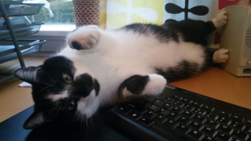

HwCpp Getting Started
===

<!-- update example_path( "../demo/" ) -->

<!--
TO DO list
- 
-->

*****************************************************************************

# 1 Introduction

HwCpp is (only) a library. 
To build and download an application you need, 
besides HwCpp and your application code, 
at least the following:
 - a toolchain (compiler, linker, and associated tools) for your target(s)
 - the header files for the target device (in most cases provided by the vendor)
 - a linkerscript suitable for the target device
 - a download, communication and/or debug tool for the target device
 - scripts to invoke the various tools with appropriate parameters
 - (optionally) an IDE to edit the source and invoke the scripts

This document explains how to get started with HwCpp using either
  - bmptk and CodeLite
  - the Arduino IDE 
for now, both only for windows.

*****************************************************************************

<!-- update table_of_contents( input ) -->

  - [1 Introduction](#toc-anchor-0)

  - [2 Using the Arduino IDE on Linux](#toc-anchor-1)

  - [3 Using the Arduino IDE on Windows](#toc-anchor-2)

  - [4 Using BMPTK and CodeLite on Linux](#toc-anchor-3)

  - [5 Using BMPTK and CodeLite on Windows](#toc-anchor-4)

  - [6 First use](#toc-anchor-5)

    - [6.1 Bmptk](#toc-anchor-6)

    - [6.2 CodeLite](#toc-anchor-7)

<!-- update end -->

# 2 Using the Arduino IDE on Linux

- install the Arduino IDE
sudo apt-get install arduino
- start arduino, I was asked to confirm that I was added to a dial-out group,
  and a restart was needed for that to take effect
- install git
sudo apt install git
- 
cd /usr/share/arduino/libraries
sudo git clone http://github.com/bmptk
hwlib
hwcpp

# 3 Using the Arduino IDE on Windows

The AVR IDE is (IMO) not a very good IDE and its build process is slow,
but it is easy to install and contains a lot of build and download tools.

By itself, the Arduino IDE will use an old version of the compiler, 
and the C++ language version is set to C++11. 
For HwCpp C++17 and concepts are required, hence you
must install a different compiler toolchain, and change
the language version. 

Do these steps:
 - install the Arduino IDE
 - for AVR targets (Arduino Uno, Nano, Micro, etc.) 
    - go to the directory arduino/hardware/tools
    - make a copy the avr directory (in case you want to roll back)
      but not in the current directory
    - get GCC for avr8 from http://blog.zakkemble.co.uk/avr-gcc-builds/ , 
    - copy the content of the avr-gcc-* directory in the zip 
      *over* the arduino/hardware/tools/avr directory
      (this will cause a lot of files to be overwritten)
    - go to the directory 
      arduino/hardware/arduino/avr and use a text 
      editor to create the file platform.local.txt with the single line
~~~
   compiler.cpp.extra_flags= -std=c++17 -fconcepts
~~~ 
   - for Cortex targets (Arduino Due, Blue Pill, etc.) 
     start the IDE, go to Tools -> Board -> Boards Manager, 
     and install support for "Arduino SAM Boards" and "STM32Fxx/GD32Fxx boards"
   - install the GCC for arm/cortex from 
     https://developer.arm.com/open-source/gnu-toolchain/gnu-rm/downloads
     and remember where it was put
   - find where the Arduino IDE has hidden the arm gcc compiler, most likely 
     something like
     C:\Users\<your user name>\AppData\Local\Arduino15\packages\arduino\tools   
   - Rename the arm-none-eabi-gcc to arm-none-eabi-gcc-old
   - Copy the GCC you installed to that tools directory, replacing the one
     the Arduino IDE installed
   - in the ....\packages\arduino\tools\hardware\sam\1.6.11 directory,
     use a text editor to create a platform.local.txt file with the one line
~~~
   compiler.cpp.extra_flags= -std=c++17 -fconcepts
~~~ 	 
 - install git for windows from https://git-scm.com/download/win	 
 - go to the directory arduino/libraries, 
   right-click in Explorer to start a Git Bash Here
 - in the bash window, run 
~~~
   git clone http://github.com/wovo/hwcpp
~~~

To verify that everything works:
  - connect the Arduino
  - start the Arduino IDE
  - select Tools -> Board -> the board that you use (Arduino/Genuino Uno, Arduino Due)
  - select Tools -> Port -> the port that connects to your hardware
  - click File -> Examples -> HwCpp -> Blink
  - click Sketch -> Upload

To see the code sizes and the assembly output, take these steps:
  - in the arduino/hardware/tools/avr/bin directory, create an avr-dum.bat file
    with the following two lines:
~~~
"C:\Program Files (x86)\Arduino\hardware\tools\avr\bin\avr-objdump" -S "%1.elf" > "%1.lst"
"C:\Program Files (x86)\Arduino\hardware\tools\avr\bin\avr-nm" -C -r --radix=d "%1.elf" > "%1.fns"
rem build directory:  %1
~~~
  - in the arduino/hardware/arduino/avr/platform.txt file, add this line
    at the end of the "## Create output files (.eep and .hex)" section:
~~~
recipe.objcopy.zzz.pattern="{compiler.path}avr-dump" "{build.path}/{build.project_name}"
~~~
  - in the IDE, enable File -> Preferences -> Show verbose output during compilation"
  - now when you build, you will see a line near the end that shows the build directory.
    In this directory you will find the .fns file that lists the functions sorted by size,
    and the .lst file that contains the (dis)assembly listing.
	

# 4 Using BMPTK and CodeLite on Linux

  - install CodeLite
~~~
sudo apt-key adv --fetch-keys http://repos.codelite.org/CodeLite.asc
sudo apt-add-repository "deb http://repos.codelite.org/ubuntu/ $(lsb_release -sc) universe"
sudo apt-get update
sudo apt-get install codelite wxcrafter  
~~~

# 5 Using BMPTK and CodeLite on Windows

Download and install:
 - Python 3.6 from http://www.python.org to C:/python36
 - CodeLite from https://codelite.org (I used 11.0.0)
 - Git from https://git-scm.com/download/win
 - GCC for windows native from http://www.msys2.org (x86_64) 
   to C:\msys64
 - GCC for avr8 from http://blog.zakkemble.co.uk/avr-gcc-builds/ , 
   copy the zip content to C:\Program Files .
 - GCC for arm/cortex from http://gnutoolchains.com/arm-eabi/ 
   to
 - ST-LINK utility from http://www.st.com/content/st_com/en/products/development-tools/hardware-development-tools/development-tool-hardware-for-mcus/debug-hardware-for-mcus/debug-hardware-for-stm32-mcus/st-link-v2.html
   to C:/Program Files (x86)/STMicroelectronics/STM32 ST-LINK Utility
   
I had to run the various installers as administrator, and afterwards
my virusscanner still refuses to run some tools untill I told it to hush up.

Create a directory of your choice. 
Go there, and clone (right-click in the explorer, "Git Bash Here", git clone ...) these repositories:
 - http://github.com/wovo/bmptk
 - http://github.com/wovo/hwcpp

Add the bmptk/tools directory to your PATH.

When you installed on of the applications to a different directory, you
must edit hwcpp/

# 6 First use

## 6.1 Bmptk

 - Open the hwcpp/demos/native/hello directory in windows explorer.
 
 - right-click in the files area and open a 'Git Bash Here' window.  
   - If that option doesn't show, Git wasn't installed correctly.
   
 - In the git window, give the command 'bmptk-make build'
   - If bmptk-make can't be found, you didn't add the bmptk/tools directory to your PATH.
   - If you get a 'The system cannot find the path specified' error you either 
   didn't install thge MingW toolchain, or the ....

## 6.2 CodeLite

 - Open the hwcpp/demos/native directory in windows explorer.

 - Run (double-click) the update_codelite_workspace.bat file.
This should produce a message window that shows that bmptk projects are created for each subdirectory.
Press return to close the window.
 - Run (double-click) the _codelite.workspace file. If windows doesn't know how to open a
 file with this extension, associate it with the CodelIte executable. Now CodeLite starts.

