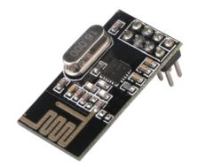

HwCpp

nRF24L01

&nbsp;

&nbsp;

<table cellpadding="5" border="1" style="border-collapse: collapse;">
<tr><td> author    </td><td> Wouter van Ooijen  (wouter.vanooijen@hu.nl)     </td></tr>
<tr><td> version   </td><td> work in pogress :)     </td></tr>
<tr><td> location  </td><td> github.com/wovo/hwcpp  </td></tr>
<tr><td> license   </td><td> CC BY-NC 2.5           </td></tr>
</table>

<!--
TO DO list
-->

<!-- update example_path( "../include/chips/hwcpp-nrf24l01.hpp" ) -->

&nbsp;

*****************************************************************************

# 1 Introduction

HwCpp is a library for close-to-the-hardware programming.
It can be found at www.github.com/wovo/hwcpp.

This document describes the HwCpp NRF24L01 library

*****************************************************************************

# 2 Content

<!-- update table_of_contents( input, 3 ) -->

  - [1 Introduction](#toc-anchor-0)

  - [2 Content](#toc-anchor-1)

  - [3 The nRF24L01](#toc-anchor-2)

    - [3.1 General](#toc-anchor-3)

    - [3.2 Configuration](#toc-anchor-4)

    - [3.3 Interfaces](#toc-anchor-5)

      - [3.3.1 CTO](#toc-anchor-6)
        [3.3.2 Low-level interface](#toc-anchor-7)
        [3.3.3 Features interface](#toc-anchor-8)
        [3.3.4 High-level interface](#toc-anchor-9)

<!-- update end -->

&nbsp;

*****************************************************************************

# 3 The chip

## 3.1 Applications

The nRF24L01 is a popular 2.4 GHz transceiver 
(combined transmitter and receiver) chip. 
It is typically used in short-range low-cost low-datarate applications 
like wireless PC peripherals, doorbells, and weather stations.
Modules that combine the chip with the crystal, a PCB antenna and
some passive components can be bought very cheap from Chinese websites.
According to many websites these cheap modules are likely to contain 
some lower-quality clone instead of the real chip.

Variations of this chip exist with less features (nRF2401), 
more features (nRF24L01+).
The RFM70 is a work-alike that is compatible, except for
a very complex initialization.

## 3.2 Configuration

Some settings must be the shared by chips to 
be able to communicate with each other:

   - The air data rate can be 1 MHz or 2 MHz. 
     The higher rate offers faster transmission, 
     the lower rate offers a little more distance (+3 dB).
     Distance and power consumption are (also) influenced by the 
     transmit power setting (4 levels) and the LNA (receiver) gain setting 
     (2 levels). 

   - The chip operates in one of 128 frequency 
     bands within the 2.4 GHz range.
     When the air data rate is 1 MHz, adjacent frequency bands 
     can be used other chips.
     When it is 2 MHz, the bands next to one that is used
     must be left unused.

   - A CRC can be used or not. 
     When used, it can be 1 or 2 bytes long.

   - Channel addresses are used to identify the intended receiver 
     of a message. 
     The length of an address is configurable as 1..5 bytes

   - Messages can be fixed length (32 bytes) or varying in length
     (1..32 bytes). 

The receiver part of the chip listens to up to 6 channels,
identified by an address.
The channels 0 and 1 have separate addresses of (up to 5) bytes.
The channels 2..5 use the channel 1 address but with a different
(individually configurable) lowest byte.

Each channel can be configured for fixed length messages (32 bytes)
or varying length messages (1..32 bytes), 
and for datagram (unacknowledged)
or acknowledged (with timeout and retries). 
When acknowledges are used (on at least one channel) CRC use is 
automatically enabled.

The chip uses a SPI interface and a separate CE line that 
can be used to power-down the chip.

After startup, the chip must be configured in accordance with the
other chip(s) it must communicate with.

The chip has an interrupt (output) pin, which is not used
by the interface.

## 3.3 Interfaces

The library provides interfaces to the chip at a number of levels.

   - The low-level interface provides access to the commands
     and registers of the chip as raw bytes.

   - The features interface provides named access to the individual
     fields and other individual features of the chip.

### 3.3.1 CTO

The chip interface is a static class template that must be
instantiated by the user to create a cto.
All subsequent interface elements are defined within this 
cto.
The usual for a cto, the ::init() function must be called 
before any other functions are used.

<!-- update quote( input, "", "##cto" ) -->
~~~C++
template<
   typename     _bus,    // the SPI bus (MOSI, MISO, SCK)
   can_pin_out  _ce,     // the CE (Chip Enable) pin
   can_pin_out  _csn,    // the SPI Chip Select (Negative) pin
   is_waiting   timing   // the timing service
>
struct nrf24l01_spi_ce_csn ;
~~~

### 3.3.2 Low-level interface

The low-level interface provides direct access to the chip.
The cto hardware template parameters are available
(for instance to power-down the chip using the ce pin).
Over the SPI bus, commands can be sent, and (using the
read and write commands) registers can be read or written.

<!-- update quote( input, "", "##hw-interface" ) -->
~~~C++
   using bus  = _bus;
   using ce   = pin_out< _ce >;
   using csn  = pin_out< _csn >;
~~~

The set of commands is defined by an enumerate:

<!-- update quote( input, "", "##commands" ) -->
~~~C++
   enum class cmd : uint8_t {
      read_reg           = 0x00, // read a register
      write_reg          = 0x20, // write a register
      r_rx_payload       = 0x61, // read a received payload
      w_tx_payload       = 0xa0, // write a payload to be sent
      flush_tx           = 0xe1, // empty the transmit queue
      flush_rx           = 0xe2, // empty the receive queue
      reuse_tx_pl        = 0xe3, // start continuous retransmission
      activate           = 0x50, // toggle register bank or extended functions
      r_rx_pl_wid        = 0x60, // read length of fifo top payload
      w_ack_payload      = 0xa8, // write payload to be transmitted with ack
      w_tx_payload_noack = 0xb0, // write payload to be sent without auto-ack
      nop                = 0xff  // no action, can be used to read the status
   };
~~~

The command functions issues a command, 
with and optional single data byte (for the activate command) 
or an array of bytes (for the w_ack_payload and w_tx_payload_noack commands).
The functions return the chip status byte.

<!-- update quote( input, "", "##fcommand" ) -->
~~~C++
   static uint_fast8_t write( cmd c );
   static uint_fast8_t write( cmd c, uint8_t d );
   template< size_t n >
   static uint_fast8_t write( cmd c, const std::array< uint8_t, n > & d );
~~~~

Another enumerate defines the set of registers:

<!-- update quote( input, "", "##registers" ) -->
~~~C++
   enum class reg : uint8_t {
      config             = 0x00, // configuration register
      en_aa              = 0x01, // enable auto ack on pipes
      en_rxaddr          = 0x02, // enable receive pipes
      setup_aw           = 0x03, // set address length
      setup_retr         = 0x04, // retransmission settings
      rf_ch              = 0x05, // rf channel (frequency)
      rf_setup           = 0x06, // data rate, transmit power, lna
      status             = 0x07, // status register
      observe_tx         = 0x08, // lost and retransmitted packets
      cd                 = 0x09, // carrier detect
      rx_addr_p0         = 0x0a, // receive address pipe 0, 5 bytes
      rx_addr_p1         = 0x0b, // receive address pipe 1, 5 bytes
      rx_addr_p2         = 0x0c, // receive address pipe 2, 1 byte
      rx_addr_p3         = 0x0d, // receive address pipe 2, 1 byte
      rx_addr_p4         = 0x0e, // receive address pipe 2, 1 byte
      rx_addr_p5         = 0x0f, // receive address pipe 2, 1 byte
      tx_addr            = 0x10, // transmit adress, 5 bytes
      rx_pw_p0           = 0x11, // number of bytes in pipe 0 package
      rx_pw_p1           = 0x12, // number of bytes in pipe 1 package
      rx_pw_p2           = 0x13, // number of bytes in pipe 2 package
      rx_pw_p3           = 0x14, // number of bytes in pipe 3 package
      rx_pw_p4           = 0x15, // number of bytes in pipe 4 package
      rx_pw_p5           = 0x16, // number of bytes in pipe 5 package
      fifo_status        = 0x17, // receive and transmit fifo status (RO)
      dynpd              = 0x1c, // dynamic payload flags
      feature            = 0x1d  // special features flags
   };
~~~

Read and write functions are provided that read or a write a single 
register, or write an array of bytes to a register. 
(There are no registers from which more than one byte can be read,
hence there is no function for that.)

<!-- update quote( input, "", "##read-write" ) -->
~~~C++
   template< size_t n >
   static uint8_t read( reg r );
   template< size_t n >
   static void read( reg r, std::array< uint8_t, n > & d );
   static void write( reg r, uint8_t d );
   template< size_t n >
   static void write( reg r, const std::array< uint8_t, n > & d );
~~~~

### 3.3.3 Features interface

The feature interface provides functions that provide access 
to individual features, which are often subfields of registers.
Not all features are available in this way.

The status() function returns the status register value.

<!-- update quote( input, "", "##status" ) -->
~~~C++
   static uint_fast8_t status();
~~~~

The extensions_toggle() function toggles the status (enabled / disabled)
of some extended (compared to an nRF2401) features. 
There seems to be no (easy) way to check whether these extensions
are currently enabled, which poses a problem if you don't know
the initial state.
On the chip that I checked, this function seemed to enable rather
than toggle the extensions, which avoids the poblem.

<!-- update quote( input, "", "##extensions" ) -->
~~~C++
   static void extensions_toggle();
~~~~

The interrupts_clear() function clears the interrupt status.

<!-- update quote( input, "", "##interrupts" ) -->
~~~C++
   static void interrupts_clear();
~~~~

The channel() function sets the channel / band (0..127) 
within the 2.4 GHz band that the chip uses. 
The center frequency is 2400 MHz + ch * 1 Mhz, for
a range of 2.4 .. 2.525 GHz.
With a 1 MHz air data rate the bandwith is 1 MHz, so
each channel can be used. 
With an air data rate of 2 MHz the bandwith overlaps
the adjacent channels, so used channels must be
separated by at least one unused channel.

<!-- update quote( input, "", "##channel" ) -->
~~~C++
   static void channel( uint8_t ch );
~~~~

The air_data_rate(rate) function sets the 
air data rate (1 or 2 MHz) the chip uses.
The lower data has rate a 3 dB better receiver sensitivity
(longer range)
and each frequency channel can be used independently,
but transmission takes more time, and hence more power
when the chip is would be powered down after a transmission.

<!-- update quote( input, "", "##air-data-rate" ) -->
~~~C++
   static void air_data_rate( uint_fast8_t rate );
~~~~

The CRC length can be set to 0 (no CRC used), 1 byte, or 2 bytes.

<!-- update quote( input, "", "##crc-length" ) -->
~~~C++
   static void crc_length( uint8_t len );
~~~~

The channel address length can be set to 1..5 bytes.

<!-- update quote( input, "", "##address-length" ) -->
~~~C++
   static void address_length( uint8_t len );
~~~~

The transmit_fifo_full() full function reports whether
the tranmit fifo (3 entries) is currently full.
Don't attempt to tranmit a new message when this is true.

<!-- update quote( input, "", "##tx-fifo-full" ) -->
~~~C++
   static bool transmit_fifo_full();
~~~~

The receive_fifo_empty() full function reports whether
the receive fifo (3 entries) is currently empty.
Don't attempt to retrieve a message when this is true.

<!-- update quote( input, "", "##rx-fifo-empty" ) -->
~~~C++
   static bool receive_fifo_empty();
~~~~

These functions set the channel addresses for the
channels 0 and 1.
The number of bytes in the address should be the same
as configured address length.
If it is larger, the LSBs are used. 

<!-- update quote( input, "", "##rx-address-01" ) -->
~~~C++
template< size_t n > concept bool range_1_5 = ( ( n >0 ) && ( n < 6 ) );
   template< range_1_5 n >
   static void receive_address_p0( const std::array< uint8_t, n > address );
   template< range_1_5 n >
   static void receive_address_p1( const std::array< uint8_t, n > address );
~~~~

These functions set the LSB of the channel addresses 
for the channels 2 .. 5.
The higher channel address bytes for these channels 
are copied from the channel 1 address.

<!-- update quote( input, "", "##rx-address-n" ) -->
~~~C++
   static void receive_address_pn( uint8_t channel, uint8_t address );
~~~~

The transmit_address() function sets the channel address 
in the transmitted messages.
To use the auto retry feature, receiver channel 0
must be set to the same address.

<!-- update quote( input, "", "##tx-address" ) -->
~~~C++
   template< range_1_5 n >
   static void transmit_address( const std::array< uint8_t, n > address );
~~~~

The retransmit_count() function returns the number of retransmissions.
This number reset when a new transmission is started.

<!-- update quote( input, "", "##retransmit-count" ) -->
~~~C++
   static uint_fast8_t retransmit_count();
~~~~

The lost_packets_count() function returns of packets that
were lost (not acknowledged, even after the maximum number
of retransmissions).
This number stucks at (will not be incremented past) 15.
This number reset when a the channel frequency band register is written.
The function lost_packets_reset() does this by reading
and writing this register.

<!-- update quote( input, "", "##lost-packets-count" ) -->
~~~C++
   static uint_fast8_t lost_packets_count();
~~~~
<!-- update quote( input, "", "##lost-packets-reset" ) -->
~~~C++
   static void lost_packets_reset();
~~~~

The pipe_autoack() functions configures for a
pipe whether automatic retransmission is used or not.
The feature can be enabled or disabled for all pipes
at once, or for a specific pipe (0..5).

<!-- update quote( input, "", "##pipe-autoack" ) -->
~~~C++
   static void pipe_autoack( uint8_t pipe, bool enabled );
~~~~

The pipe_enable() function configures for a
data pipe whether it is used or not.
This can be done for all pipes
at once, or for a specific pipe (0..5).

<!-- update quote( input, "", "##pipe-enable" ) -->
~~~C++
   static void pipe_enable( uint8_t pipe, bool enabled );
~~~~

The retransmit_delay_attempts() function configures the 
delay before a retranmission (0..15, steps of 250 uS) 
and the maximum number of retransmissions 
(0..15, 0 effectively disables retransmissions).

<!-- update quote( input, "", "##retransmit-delay-attempts" ) -->
~~~C++
   static void retransmit_delay_attempts( uint8_t d, uint8_t n );
~~~~

These functions enable or disable the higher LNA current.
The high setting provides 1.5 dB more sensitivity at a cost
of 0.8 mA more current consumption.

<!-- update quote( input, "", "##lna" ) -->
~~~C++
   static void lna_high();
   static void lna_low();
   static void lna( uint8_t x );
~~~~

This function sets the tranmistter output power level (0..3).

| Setting    | Power         | DC current consumption  |
| ---------- |---------------| ------------------------|
| 00         |  0 dBm        |                11.3 mA  |
| 01         | -6 dBm        |                 9.0 mA  |
| 10         | -12 dBm       |                 7.5 mA  |
| 11         | -18 dBm       |                 7.0 mA  |

<!-- update quote( input, "", "##power" ) -->
~~~C++
   static void power( uint8_t level );
~~~~

The lna_high() and lna_low() functuions enable and disable the 
higher LNA current.
The high setting provides 1.5 dB more sensitivity at a cost
of 0.8 mA more current consumption.

<!-- update quote( input, "", "##lna" ) -->
~~~C++
   static void lna_high();
   static void lna_low();
   static void lna( uint8_t x );
~~~~

The receive_next_pipe() function returns the number (0..5) of
the pipe on which the message at the head of the message fifo
was received, 7 when the fifo is empty.

<!-- update quote( input, "", "##next-pipe" ) -->
~~~C++
   static uint_fast8_t receive_next_pipe();
~~~~

The receive_next_length() function returns the length (1..32) of
the message at the head of the message fifo.

<!-- update quote( input, "", "##next-length" ) -->
~~~C++
   static uint_fast8_t receive_next_length();
~~~~

The transmit_message() and transmit_message_once() functions
enter a new message into the message fifo for transmission.
The transmit_message_once() function will transmit the message
only once, even when automatic retransmission is configured.

<!-- update quote( input, "", "##transmit" ) -->
~~~C++
template< size_t n > concept bool range_1_32 = ( ( n > 0 ) && ( n < 33 ) );
   template< range_1_32 n >
   static void transmit_message( std::array< uint8_t, n > data );
   template< range_1_32 n >
   static void transmit_message_once( std::array< uint8_t, n > data );
~~~~

### 3.3.4 High-level interface

The high-level interface bundles the feature settings.

This configure() function sets the air configuration
according to the provided parameter.

<!-- update quote( input, "", "##air-configuration" ) -->
~~~C++
   struct air_configuration {
      uint_fast8_t channel;
      uint_fast8_t air_data_rate;
      uint_fast8_t crc_length;
      uint_fast8_t power;
      uint_fast8_t lna;
      uint_fast8_t address_length;
   };
   static void configure( const air_configuration conf );
~~~~

These functions put the chip in receive, transmit, standby
or power down mode.

<!-- update quote( input, "", "##modes" ) -->
~~~C++
   static void mode_receive();
   static void mode_transmit();
   static void mode_standby();
   static void mode_powerdown();
~~~~

The receive() function polls the receive fifo for a message.
If the fifo is empty, it returns false.
If there is a message in the fifo, it is retrieved and returned in buf. 
The pipe number and the number of bytes in the message are also
returned in parameters.
When the buf parameter is smaller than the number of bytes
the excess bytes are dropped.

<!-- update quote( input, "", "##receive" ) -->
~~~C++
   template< size_t n >
   static bool receive(
      uint8_t & pipe,
      std::array< uint8_t, n > & buf,
      uint8_t & length = n
   );
~~~~

