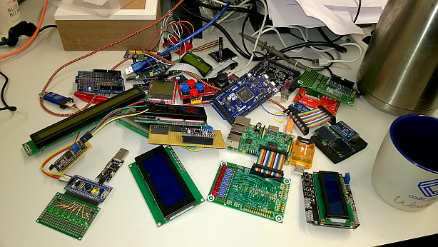
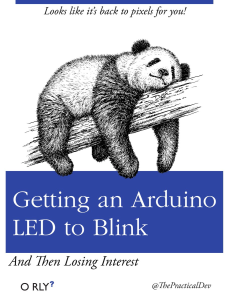
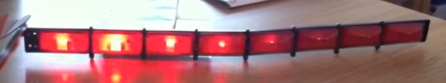
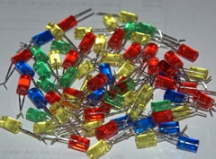
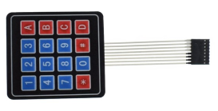
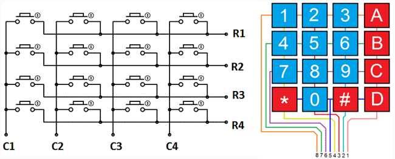

HwCpp

Primer

&nbsp;

&nbsp;

<table cellpadding="5" border="1" style="border-collapse: collapse;">
<tr><td> author    </td><td> Wouter van Ooijen  (wouter.vanooijen@hu.nl)     </td></tr>
<tr><td> version   </td><td> work in pogress :)     </td></tr>
<tr><td> location  </td><td> github.com/wovo/hwcpp  </td></tr>
<tr><td> license   </td><td> CC BY-NC 2.5           </td></tr>
</table>

<!-- update example_path( "../demo/" ) -->

<!--
TO DO list
- spikey groter
- fanout for ports
- input pins
- LCD schield must be 16x2
- non-flickering LCD example
- image for LCD "HwCpp formatted character output"
- terminal (stream) input
- A/D conversion, led bar, keys from LCD shield
- keypad read and translate in hwcpp, add to chapter
-->

&nbsp;

*****************************************************************************

# 1 Introduction

HwCpp is a library for writing close-to-the-hardware 
(bare metal) micro-controller applications. 
This document provides a gentle introduction to using HwCpp.
Basic C++ and hardware knowledge is assumed, but nothing too advanced.
The document is organized to minimize forward references.

Getting HwCpp to work is not covered in this document
(check the 'getting started' document).

This document is licenced under the CC BY-NC 2.5:
[creativecommons.org/licenses/by-nc/2.5](creativecommons.org/licenses/by-nc/2.5).

&nbsp;

*****************************************************************************

# 2 Content

<!-- update table_of_contents( input ) -->

  - [1 Introduction](#toc-anchor-0)

  - [2 Content](#toc-anchor-1)

  - [3 Blink a led](#toc-anchor-2)

  - [4 Kitt](#toc-anchor-3)

  - [5 Fun with more LEDs using fanout<>](#toc-anchor-4)

  - [6 Input and output pins](#toc-anchor-5)

  - [7 Character output](#toc-anchor-6)

<!-- update end -->

&nbsp;

*****************************************************************************

# 3 Blink a led

Blinking a LED is the "Hello world!" equivalent for micro-controllers,
so let's start with that.

<!-- update example( input, "arduino-uno/blink-for-loop/main.cpp" ) -->
~~~C++
#include "hwcpp.hpp"

using target = hwcpp::target<>;
using timing = target::timing;
using led    = target::led;

int main(){ 
   led::init();
   timing::init();
   
   for(;;){
      led::set( 1 );
      timing::ms< 200 >::wait();
      led::set( 0 );
      timing::ms< 200 >::wait();
   }
}
~~~

A typical HwCpp application is a single main.cpp file that includes 
and combines the parts of the application. 

~~~C++
#include "hwcpp.hpp"
~~~

The default way to specify which target is used 
is to put that information in
the makefile, which passes it to the compiler as a command-line macro.
The application just includes "hwcpp.hpp", which includes 
the appropriate target-specific parts of HwCpp. 

~~~C++
using target = hwcpp::target<>;
~~~

All hwcpp stuff is inside the namespace hwcpp. 
This includes the target<> template, which is, 
through makefile/macro/hwcpp.hpp magic, the target micro-controller 
or board you are building your application for.
By default, the target will use the highest clock speed possible, 
but in some cases you can specify a slower clock speed as template parameter.
In this case no template parameter is given, 
so the target will run full-speed.

~~~C++
using timing = target::timing;
~~~

Most things in HwCpp are classes, not objects, 
so :: is used to select a thing within another thing. 
The line above selects the default timing service offered by
our target as the timing we will use.
A timing service is what you need to wait for a specific
amount of time.

~~~C++
using led    = target::led;
~~~

This blinky application is written for a target board that has an
on board default LED. 
This is the case for the most boards, including all currently supported
targets boards (Arduino Uno, Arduino Due, Blue Pill, STM32 minisystem).

~~~C++
   led::init();
   timing::init();
~~~

Most 'things' in HwCpp are classes, not objects, but the play roughly the 
same role objects do in standard OO style applications.
Objects are initialized by their constructors. 
HwCpp classes, which are called Compile Time Objects (cto's), 
are initialized by calling their ::init() function. 
*All* cto's must be initialialized in this way before they are used.
Here we initialize the two cto's we will use: the timing and the LED.
(If they in turn use otrher cto's, it is their duty to initialized those.)

~~~C++
   for(;;){
      . . .
   }
~~~

A micro-controller application has no Operating System to return to, 
hence it typically contains a never-ending loop.
We can probably bike-shed forever about the best way to write
such a loop, but I prefer for(;;) so that is what you will see.
   
~~~C++
      led::set( 1 );
      . . .
      led::set( 0 );  
~~~

The LED cto has a ::set() function that accepts a single bool value
and makes its pin high or low according to the parameter.

~~~C++
      timing::ms< 200 >::wait();
~~~

The timing cto has a set of macro's (ns<>, us<>, ms<>, s<>) 
that are used to specify a duration of the specified amount of time.
Such a duration cto has a ::wait() function that will wait for
the appropriate amount of time.
Duration cto's are a little bit special in that they have an
init() function, but when the init() of their timing service has
been called it is not required to call the init() of the duration.

The point of a library is to make writing applications easier,
so HwCpp has a blink<> function template that can be used to write a 
blinky. It requires the pin that must be blinked, and the
duration of the on and off periods.  

The HwCpp convention is that calling ::init() on cto's is
the duty of the code that uses the cto's.
Hence in this case it is the duty of the hwcpp::blink<> template 
to ::init() the led and duration, so we don't have to write
those lines. 
And because the timing is now mentioned only once 
the using... line for that can be omitted.

<!-- update example( input, "arduino-uno/blink-blink-1/main.cpp" ) -->
~~~C++
#include "hwcpp.hpp"

using target = hwcpp::target<>;

int main(){ 
   hwcpp::blink< 
      target::led, 
      target::timing::ms< 200 > 
   >();
}
~~~

The using... line for the target could be omitted too, but 
the target is mentioned twice, so in my taste omitting that
line produces a blinky that is shorter, 
but slightly less pleasing to the eye.

<!-- update example( input, "arduino-uno/blink-blink-2/main.cpp" ) -->
~~~C++
#include "hwcpp.hpp"

int main(){ 
   hwcpp::blink< 
      hwcpp::target<>::led, 
      hwcpp::target<>::timing::ms< 200 > 
   >();
}
~~~

&nbsp;

*****************************************************************************

# 4 Kitt

After blinking a single LED, the next step is to do something with a bunch of LEDs. 
The Kitt display (one LED back-and-forth, from the Knightrider series) 
is the standard example for this.

<!-- update example( input, "arduino-uno/led-6-kitt/main.cpp" ) -->
~~~C++
#include "hwcpp.hpp"

using target = hwcpp::target<>;
using timing = target::waiting;

using pins = hwcpp::port_out< 
   target::d8,
   target::d9,
   target::d10,
   target::d11,
   target::d12,
   target::d13
>;

int main(){ 
   hwcpp::kitt< pins, timing::ms< 50 > >();
}
~~~

The supported target boards don't have a string of LEDs, 
so instead the pins that connect to the LEDs are specified.
This application is for the Arduino Uno target, 
hence the Arduino pin names are used.
(Alternatively, the pin names of the atMega328 chip could be used.)
I used six pins are conveniently located next to a ground pin.

~~~C++
using pins = hwcpp::port_out< 
   target::d8,
   target::d9,
   target::d10,
   target::d11,
   target::d12,
   target::d13
>;
~~~

The 6 pins are combined into a port_out.
A port is an (ordered) bundle of pins, 
and '_out' indicates that the port can be used only as output. 

~~~C++
   hwcpp::kitt< pins, timing::ms< 50 > >();
~~~

We could write the kitt functionality ourselves, but HwCpp has a 
function template for that, which requires a port and a duration. 
We pass those parameters, call the function, and kitt is alive.

A kitt display can be made more 'lively' by introducting an 'off'
period before a next LED light up. This can be done
by putting a pin_out_dummy between the LEDs (and at the ends).
This pin_out_dummy is a pin-out cto (you wouldn't have guessed)
that has a put() function that does nothing.

<!-- update example( input, "arduino-uno/led-6-kitt-skip/main.cpp" ) -->
~~~C++
#include "hwcpp.hpp"

using target = hwcpp::target<>;
using timing = target::waiting;

using pins = hwcpp::port_out< 
   hwcpp::pin_out_dummy,
   target::d8,
   hwcpp::pin_out_dummy,
   target::d9,
   hwcpp::pin_out_dummy,
   target::d10,
   hwcpp::pin_out_dummy,
   target::d11,
   hwcpp::pin_out_dummy,
   target::d12,
   hwcpp::pin_out_dummy,
   target::d13,
   hwcpp::pin_out_dummy
>;

int main(){ 
   hwcpp::kitt< pins, timing::ms< 80 > >();
}
~~~

&nbsp;

*****************************************************************************

# 5 Fun with more LEDs using fanout<>

Blinking can be made more interesting by blinking more than just a single LED.
A bunch of pins can be combined into a something that walks and quacks like
a single (output) pin with the hwcpp::fanout<> template. 
To blink the six LEDs of the kitt example in unison, all
we need is to do is combine them into a single 'pin', and pass that pin
to the blink function.

<!-- update example( input, "arduino-uno/led-6-together/main.cpp" ) -->
~~~C++
#include "hwcpp.hpp"

using target = hwcpp::target<>;
using timing = target::waiting;

using pins = hwcpp::fanout< 
   target::d8,
   target::d9,
   target::d10,
   target::d11,
   target::d12,
   target::d13
>;

int main(){ 
   hwcpp::blink< pins, timing::ms< 200 > >();
}
~~~

The hwcpp::invert<> decorator template can be used to create a pin that inverses
the behavior of the pin it decorates. If we invert the first
three pins this way before passing them to fanout, the LEDs
alternate left-right.

<!-- update example( input, "arduino-uno/led-6-left-right-1/main.cpp" ) -->
~~~C++
#include "hwcpp.hpp"

using target = hwcpp::target<>;
using timing = target::waiting;

using pins = hwcpp::fanout< 
   hwcpp::invert< target::d8 >,
   hwcpp::invert< target::d9 >,
   hwcpp::invert< target::d10 >,
   target::d11,
   target::d12,
   target::d13
>;

int main(){ 
   hwcpp::blink< pins, timing::ms< 200 > >();
}
~~~

A different way to get the same effect is to
first combine the two groups of three LEDs, then invert one,
and finally combine the two groups.

<!-- update example( input, "arduino-uno/led-6-left-right-2/main.cpp" ) -->
~~~C++
#include "hwcpp.hpp"

using target = hwcpp::target<>;
using timing = target::waiting;

using pins = hwcpp::fanout< 
   hwcpp::invert< hwcpp::fanout< 
      target::d8,
      target::d9,
      target::d10 > >,
   hwcpp::fanout< 
      target::d11,
      target::d12,
      target::d13 >
>;

int main(){ 
   hwcpp::blink< pins, timing::ms< 200 > >();
}
~~~

A simple variation alternates between the even and odd LEDs.

<!-- update example( input, "arduino-uno/led-6-even-odd/main.cpp" ) -->
~~~C++
#include "hwcpp.hpp"

using target = hwcpp::target<>;
using timing = target::waiting;

using pins = hwcpp::fanout< 
   hwcpp::invert< target::d8 >,
   target::d9,
   hwcpp::invert< target::d10 >,
   target::d11,
   hwcpp::invert< target::d12 >,
   target::d13
>;

int main(){ 
   hwcpp::blink< pins, timing::ms< 200 > >();
}
~~~

Another nice pattern is the inside-to-outside. 
The base for this is the walk<> function, 
which is like kitt, but only forward.

<!-- update example( input, "arduino-uno/led-6-walk-1/main.cpp" ) -->
~~~C++
#include "hwcpp.hpp"

using target = hwcpp::target<>;
using timing = target::waiting;

using pins = hwcpp::port_out< 
   target::d8,
   target::d9,
   target::d10,
   target::d11,
   target::d12,
   target::d13
>;

int main(){ 
   hwcpp::walk< pins, timing::ms< 50 > >();
}
~~~

If you don't like the direction in which the pattern walks,
you could of course change the order in which the pins are mentioned
in the port_out constructor, but it is easier to use hwcpp::mirror<>.

<!-- update example( input, "arduino-uno/led-6-walk-2/main.cpp" ) -->
~~~C++
#include "hwcpp.hpp"

using target = hwcpp::target<>;
using timing = target::waiting;

using pins = hwcpp::port_out< 
   target::d8,
   target::d9,
   target::d10,
   target::d11,
   target::d12,
   target::d13
>;

int main(){ 
   hwcpp::walk< hwcpp::mirror< pins >, timing::ms< 50 > >();
}
~~~

To get an inside-to-outside display, we create two ports of three LEDs,
one in the reverse order and the other in the normal order.
These two ports are combined by fanout<> to get a single port.
Running walk<> on this port creates the intended effect.

=> fanout doesn't work yet for ports

<!-- update example( input, "arduino-uno/led-6-inside-out-1/main.cpp" ) -->
~~~C++
#include "hwcpp.hpp"

using target = hwcpp::target<>;
using timing = target::waiting;

using pins = hwcpp::fanout< 
   hwcpp::port_out< 
      target::d10,
      target::d9,
      target::d8 >,
   hwcpp::port_out< 
      target::d11,
      target::d12,
      target::d13 >
>;

int main(){ 
   hwcpp::walk< pins, timing::ms< 200 > >();
}
~~~

An alternative is to create the two sub-ports both
in the standard pin order, but apply mirror<> to one 
of them before the two ports are combined by fanout<>.
I prefer this versuion because the pins are in order,
and the mirroring is explicit.

<!-- update example( input, "arduino-uno/led-6-inside-out-2/main.cpp" ) -->
~~~C++
#include "hwcpp.hpp"

using target = hwcpp::target<>;
using timing = target::waiting;

using pins = hwcpp::fanout< 
   hwcpp::mirror< hwcpp::port_out< 
      target::d8,
      target::d9,
      target::d10 > >,
   hwcpp::port_out< 
      target::d11,
      target::d12,
      target::d13 >
>;

int main(){ 
   hwcpp::walk< pins, timing::ms< 200 > >();
}
~~~

Another nice pattern is left-blink-twice, right-blink-twice.
This can be constructed by using kitt instead of blink, with
one dummy pin at each end, and a few more in the middle 
(to get a longer pause between the left and right double-blinks).

<!-- update example( input, "arduino-uno/led-6-left-right-skip/main.cpp" ) -->
~~~C++
#include "hwcpp.hpp"

using target = hwcpp::target<>;
using timing = target::waiting;

using pins = hwcpp::port_out< 
   hwcpp::pin_out_dummy,
   hwcpp::fanout< 
      target::d8,
      target::d9,
      target::d10 >,
   hwcpp::pin_out_dummy,
   hwcpp::pin_out_dummy,
   hwcpp::pin_out_dummy,
   hwcpp::fanout< 
      target::d11,
      target::d12,
      target::d13 >,
   hwcpp::pin_out_dummy
>;

int main(){ 
   hwcpp::kitt< pins, timing::ms< 200 > >();
}
~~~

&nbsp;

*****************************************************************************

# 6 Input and output pins

The pins of a micro-controller can in most cases be used in two
directions: in input mode, or in output mode, 
under control of the application. 
Such a pin is an input_output pin.
To use it, it must first be initialized and then the direction must be set.
Then its set() or get() functions can be used (depending on
the direction).

<!-- update example( input, "arduino-due/led-on-gpio/main.cpp" ) -->
~~~C++
#include "hwcpp.hpp"

using pin = hwcpp::target<>::d13;

int main(){ 
   pin::init();
   pin::direction_set( hwcpp::pin_direction::output );
   pin::set( 1 );
}
~~~

Most applications will use a specific pin in one of the directions
for the whole application. 
In such a case it makes sense to restrict the pin to the appropriate
direction. 
This prevent inadvertent use of the wrong functions, and
the init() call takes care of setting the direction
(when needed).

<!-- update example( input, "arduino-due/led-on-output/main.cpp" ) -->
~~~C++
#include "hwcpp.hpp"

using pin = hwcpp::pin_out< hwcpp::target<>::d13 >;

int main(){ 
   pin::init();
   pin::set( 1 );
}
~~~

When a pin cto is passed to a function (as a template argument)
for use as an output pin, the function should accept both
output and input-output pins. 
But this would cause a problem for the function: for
an input-output pin it should call direction_set(), but an
output pin doesn't support that function.
The pin_out<> decorator solves that problem: it converts
the argument pin to an output pin. Calling init() on that
(output) pin takes care of setting the direction when that
is needed.

<!-- update example( input, "arduino-due/led-on-function/main.cpp" ) -->
~~~C++
#include "hwcpp.hpp"

using pin = hwcpp::target<>::d13;

template< template _pin >
void set(){
   using pin = hwcpp::pin_out< _pin >;
   pin::init();
   pin::set( 1 );
}

int main(){ 
   set< pin >();
}
~~~

A 'typename' template argument will accept any type, 
even a totally inappropriate one like int.
The compiler will eventually find out that an int doesn't 
support the operations that are done inside the function, but 
the generated error message will not be pretty.

A concept can be used to restrict the accepted template arguments.
For a pin that is to be an argument to pin_out the appropriate concept
is can_pin_out.

<!-- update example( input, "arduino-due/led-on-concept/main.cpp" ) -->
~~~C++
#include "hwcpp.hpp"

using pin = hwcpp::target<>::d13;

template< hwcpp::can_pin_out _pin >
void set(){
   using pin = hwcpp::pin_out< _pin >;
   pin::init();
   pin::set( 1 );
}

int main(){ 
   set< pin >();
}
~~~

A typical keypad is organized in a matrix. 
For a 4 x 4 keypad, there are 4 horizontal lines and 4 vertical lines,
with a switch at each intersection.

Such a matrix keypad is read by scanning. 
The vertical lines are connected to input pins with a pull-up.
The horizontal lines are connected to pins that are used in
open-collector mode: they are either input
(no effect in the line), or output an low.
In turn, each line is the output while the other three are input.
When a switch is closed, this will be detected when its horizontal line
is output and low, because it will draw its column line low.

For easy vieuwing, the function encodes the key that is pressed
as 100 * row + column, where row and column are counted from 1.

<!-- update example( input, "arduino-due/keypad-diy/main.cpp", "##function" ) -->
~~~C++
template< 
   hwcpp::can_port_oc _rows, 
   hwcpp::can_port_in _columns >
int keypad_read(){
   using rows = hwcpp::port_oc< _rows >;
   using columns = hwcpp::port_in< _columns >;    
   rows::init();
   columns::init();
   timing::init();
   for( int i = 0; i < rows::n_pins; ++i ){
      rows::set( ~ ( 0x01 << i ) );
      //delay::wait();
      auto c = ~ columns::get();
      for( int j = 0; j < columns::n_pins; ++j ){
         if( ( c & ( 0x01 << j ) ) != 0 ){ 
            return 10 * ( i + 1 ) + j + 1;
         }            
      }         
   }   
   return 0;
}
~~~

The rest of the application creates the row and column ports,
calls the function, and prints the return value if it is different
from the previous call. 
The uart (which is decribed in a next section) is used to show the values.

<!-- update example( input, "arduino-due/keypad-diy/main.cpp", "##main" ) -->
~~~C++
using rows = hwcpp::port_oc<
   target::d58,
   target::d59,
   target::d60,
   target::d61 >;   

using columns = hwcpp::port_in<
   target::d54,
   target::d55,
   target::d56,
   target::d57 >;

int main(){ 
   hwcpp::ostream< target::uart > cout; 
   timing::ms< 1'000 >::wait();  
   cout << "keypad demo\n";
   int previous = 0;    
   for(;;){
      auto k = keypad_read< rows, columns >();
      if( k != previous ){
         cout << "k=" << (int32_t) k << "\n";
         previous = k;
      }         
   }   
}
~~~

&nbsp;

*****************************************************************************

# 7 Character output

Even embedded programmers want their applications to talk.
Most embedded targets have at least a serial (UART) connection,
which is (in the absence of a real debugger) often used for debug logging.
The cto for this (default) uart is available as target::uart. 

A uart is a formatted character output, which means that 
it has write() functions that accept the common types
(bool, char, ints, char *, formatters, etc).

<!-- update example( input, "arduino-uno/hello-uart/main.cpp" ) -->
~~~C++
#include "hwcpp.hpp"

using target = hwcpp::target<>;
using timing = target::timing;
using uart   = target::uart;

int main(){ 
   timing::init();    
   uart::init();
   
   for(;;){
      uart::write( "Hello world!\n" );
	  timing::ms< 1'000 >::wait();
   }	  
}

~~~

The uart is configured for HWCPP_UART_BAUDRATE, or (when that
macro is not defined) BMPTK_BAUDRATE 
(or, when that isn't defined either, 9600 baud).
When you use bmptk, this will be set to a sensible value and
after downloading a terminal window will be started with that
baudrate. 
If you don't use bmptk you can define the baudrate
macro at the compiler command line (or live with the default of 9600), 
and start your terminal application accordingly.

If you prefer to use &lt;&lt; operators, you can make a cout object
from a uart and use that object. 
The object constructor takes care of calling init() on the uart.
Currently bmptk doen't support global objects with a non-trivial constructor,
hence such a cout object must be created locally
(but it can be passed around).

<!-- update example( input, "arduino-uno/hello-cout/main.cpp" ) -->
~~~C++
#include "hwcpp.hpp"

using target = hwcpp::target<>;
using timing = target::waiting;
using uart   = target::uart;

int main(){ 
   timing::init();       
   hwcpp::ostream< uart > cout;
   
   for(;;){
      cout << "Hello world!\n";
	  timing::ms< 1'000 >::wait();
   }	  
}

~~~

Another common character output for embedded systems is the hd44780 character LCD.
To create a cto for such a display you must provide
the pins that connect to the RS (register select), E (enable), 
a port_out for the D4..D8 pins (the 4 high data inputs), 
the number of characters in the x (columns) and y (rows) directions,
and a timing service.
It is assumed that the RW (select read or write) pin is tied low 
(to ground, only write operations).

<!-- update example( input, "arduino-uno/lcd-16x1/main.cpp" ) -->
~~~C++
#include "hwcpp.hpp"

using target = hwcpp::target<>;

using lcd = hwcpp::hd44780_rs_e_d_x_y_timing< 
   target::d8, 
   target::d9,  
   hwcpp::port_out< 
      target::d4, 
      target::d5, 
      target::d6, 
      target::d7 >,
   16, 1,
   target::timing >; 	

int main( void ){
   lcd::init();
   lcd::write( "\fHello my world!" ); 
}
~~~

When you use an Arduino Uno with the common lcd-with-buttons shield you can 
use the HwCpp definition for that shield, which takes care of selecting the right pins
and the LCD size (16 characters x 2 lines).
The shield cto contains a pin for the backlight, and the lcd itself.
For my shield, the LCD backlight had to be enabled for the LCD to be readable.

<!-- update example( input, "arduino-uno/lcd-20x4-shield/main.cpp" ) -->
~~~C++
#include "hwcpp.hpp"

using target = hwcpp::target<>;
using timing = target::waiting;
using shield = hwcpp::shields::lcd_buttons< target, timing >;

int main( void ){

   shield::init();
   shield::backlight::set( 1 );

   shield::lcd::write( 
      "\fLine 1 ======== end.\n"
      "And line 2 likewise.\n"
      "This is line 3;\n"
      "And finally line 4!\n"
   );

}
~~~

The LCD examples used "\f", which clears the LCD and puts the cursor at
the top-left position.
This is part of the console functionality of an LCD.
It extends a character output with a notion of how 
many rows and columns of characters it has. 
This can be used through functions (clear(), goto_xy())
but also (and perhaps most easily) be done via data embedded
in the character stream:

 - "\n" : cursor to next line, first position
 - "\r" : cursor to current line, first position
 - "\v" : cursor to first line, first position
 - "\f" : as "\v", but also clears the display
 - "\tXXYY" : cursor to column XX, row YY. X and Y are decimal characters.

The obvious way to rewrite an LCD is to use "\f" and then write the 
lines of text, each terminated by a "\n".
This creates some flickering, so it is often better to use "\v",
and terminate each line with "\r".
         }	
(example for this using 40x4?)

