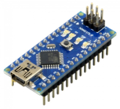
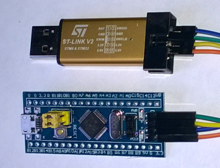
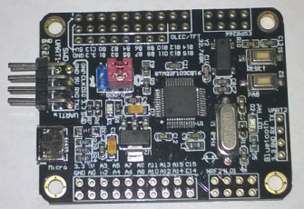

HwCpp Targets
===

<!-- update example_path( "../demo/" ) -->

<!--
TO DO list
- stm32 uarts
- check minisystem led, switch
- native sub-TOC should be on one line
- stm32 adc
- stm32 uart
- title page
- target rapi with leds
- complete the board descriptions
- blue brick resources
- http://en.mxchip.com/product/wifi_product/38
- exact type of uart, does it still have input??
- kramdown.bat
- named toc anchors?
- hierachical TOCs?
- stm32f407vet6 512 Mb FLASH, 192 Kb RAM, 168 MHz, Cortex-M4 (FPU,
- STM32_F4VE board
- https://www.aliexpress.com/item/M4-STM32F407VGT6-STM32F407VET6-Development-Board-Learning-Board-FSMC-DM9000-TFT-module/32805741770.html?ws_ab_test=searchweb0_0,searchweb201602_1_10152_10151_10065_10344_10068_10342_10343_10059_10340_10314_10341_10534_100031_10084_10604_10083_10103_10304_10307_10615_10301_10142,searchweb201603_6,ppcSwitch_5&algo_expid=df3a0b99-f79d-4670-a53c-1aba05946d61-22&algo_pvid=df3a0b99-f79d-4670-a53c-1aba05946d61&priceBeautifyAB=1
-->

<!--
nice, but markdown displays this as text :(
<table cellpadding="5"  border="1" style="border-collapse: collapse;" >

</table>
-->

<!-- update example_path( "../demo/" ) -->

*****************************************************************************

# 1 Introduction

HwCpp is a library for close-to-the-hardware programming.
It can be found at www.github.com/wovo/hwcpp.

This document describes the targets supported by HwCpp.
A target is either a (micro-controller) chip, 
or a board with such a chip (and probably some other items),
or native.

*****************************************************************************

# 2 Content

<!-- update table_of_contents( input, 3 ) -->

  - [1 Introduction](#toc-anchor-0)

  - [2 Content](#toc-anchor-1)

  - [3 Specifying the target](#toc-anchor-2)

  - [4 Hosted targets](#toc-anchor-3)

    - [4.1 Native](#toc-anchor-4)

    - [4.2 Specifying this target](#toc-anchor-5)

    - [4.3 Target properties](#toc-anchor-6)

    - [4.4 Example](#toc-anchor-7)

    - [4.5 Native](#toc-anchor-8)

  - [5 Chip targets](#toc-anchor-9)

    - [5.1 atMega328](#toc-anchor-10)

      - [5.1.1 Specifying this target](#toc-anchor-11)
        [5.1.2 Target properties](#toc-anchor-12)
        [5.1.3 Clock](#toc-anchor-13)
        [5.1.4 Timing](#toc-anchor-14)
        [5.1.5 IO items](#toc-anchor-15)
        [5.1.6 Example](#toc-anchor-16)
        [5.1.7 Resources](#toc-anchor-17)

    - [5.2 sam3x8e](#toc-anchor-18)

      - [5.2.1 Specifying this target](#toc-anchor-19)
        [5.2.2 Target properties](#toc-anchor-20)
        [5.2.3 Clock](#toc-anchor-21)
        [5.2.4 Timing](#toc-anchor-22)
        [5.2.5 IO items](#toc-anchor-23)
        [5.2.6 Example](#toc-anchor-24)
        [5.2.7 Resources](#toc-anchor-25)

    - [5.3 stm32f103c8](#toc-anchor-26)

      - [5.3.1 Specifying this target](#toc-anchor-27)
        [5.3.2 Target properties](#toc-anchor-28)
        [5.3.3 Clock](#toc-anchor-29)
        [5.3.4 Timing](#toc-anchor-30)
        [5.3.5 IO items](#toc-anchor-31)
        [5.3.6 Example](#toc-anchor-32)
        [5.3.7 Resources](#toc-anchor-33)

  - [6 Board targets](#toc-anchor-34)

    - [6.1 Arduino Uno](#toc-anchor-35)

      - [6.1.1 Specifying this target](#toc-anchor-36)
        [6.1.2 Target properties](#toc-anchor-37)
        [6.1.3 Clock](#toc-anchor-38)
        [6.1.4 Timing](#toc-anchor-39)
        [6.1.5 IO items](#toc-anchor-40)
        [6.1.6 Example](#toc-anchor-41)
        [6.1.7 Resources](#toc-anchor-42)

    - [6.2 Arduino Due](#toc-anchor-43)

      - [6.2.1 Specifying this target](#toc-anchor-44)
        [6.2.2 Target properties](#toc-anchor-45)
        [6.2.3 Clock](#toc-anchor-46)
        [6.2.4 Timing](#toc-anchor-47)
        [6.2.5 IO items](#toc-anchor-48)
        [6.2.6 Example](#toc-anchor-49)
        [6.2.7 Resources](#toc-anchor-50)

    - [6.3 Blue Pill](#toc-anchor-51)

      - [6.3.1 Specifying this target](#toc-anchor-52)
        [6.3.2 Target properties](#toc-anchor-53)
        [6.3.3 Clock](#toc-anchor-54)
        [6.3.4 Timing](#toc-anchor-55)
        [6.3.5 IO items](#toc-anchor-56)
        [6.3.6 Example](#toc-anchor-57)
        [6.3.7 Resources](#toc-anchor-58)

    - [6.4 stm32 minisystem](#toc-anchor-59)

      - [6.4.1 Specifying this target](#toc-anchor-60)
        [6.4.2 Target properties](#toc-anchor-61)
        [6.4.3 Clock](#toc-anchor-62)
        [6.4.4 Timing](#toc-anchor-63)
        [6.4.5 IO items](#toc-anchor-64)
        [6.4.6 Example](#toc-anchor-65)
        [6.4.7 Resources](#toc-anchor-66)

<!-- update end -->

*****************************************************************************

# 3 Specifying the target

The preferred way to use HwCpp is to include hwcpp.hpp in
the (single) source file, and specify the target on the
compiler command line as -DHWCPP_TARGET_*target_name*

When bmptk is used, the target is specified in the Makefile as

TARGET := *target_name*

and bmptk will put the appropriate define on the command line.

This makes it possible to use the same source for different targets,
provided that they offer the same resources under the same names. 
The following code will blink the LED on any target board that
has a default clock frequency and a default LED.

<!-- update example( input, "arduino-due/blink/main.cpp" ) -->
~~~C++
#include "hwcpp.hpp"

using target = hwcpp::target<>;
using timing = target::timing;

int main(){ 
   hwcpp::blink< target::led, timing::ms< 200 > >();
}
~~~

Alternatively, the application source file can include the 
targets/hwcpp-chip-*target-name*.hpp file directly.
This makes the source explicitly state its target.

<!-- update example( input, "arduino-due/blink-explicit-target/main.cpp" ) -->
~~~C++
#include "hwcpp-target-arduino-due.hpp"

using target = hwcpp::target<>;
using timing = target::timing;

int main(){ 
   hwcpp::blink< target::led, timing::ms< 200 > >();
}
~~~

*****************************************************************************

# 4 Hosted targets

Hosted targets create an application for the system you are developing on.

## 4.1 Native

## 4.2 Specifying this target

<table cellpadding="5" border="1" style="border-collapse: collapse;" >
<tr><td>  bmptk makefile line           </td>
   <td>      TARGET := native                  </td></tr>
<tr><td>  compiler command line define  </td>
   <td>      -DHWCPP_TARGET_native             </td></tr>
<tr><td>  direct include                </td>
   <td>      #include "hwcpp-target-native"    </td></tr>
</table>

## 4.3 Target properties

HwCpp can build for the native target, which is the system
(Windows. Linux is not yet supported) you are using.
This might be useful for module tests, but is otherwise of little use.

For compatibility with other targets, a clocking timing service and a
uart are provided.

## 4.4 Example

<!-- update example( input, "native/hello/main.cpp" ) -->
~~~C++
#include "hwcpp.hpp"

using target = hwcpp::target<>;
using timing = target::timing;
using uart   = target::uart;

int main(){ 
   hwcpp::ostream< uart > cout;  
   
   for(;;){
      cout << "Hello world!\n";
	  timing::ms< 500 >::wait();
   }	  
}
~~~

*****************************************************************************

## 4.5 Native

*****************************************************************************

# 5 Chip targets

*****************************************************************************

## 5.1 atMega328

### 5.1.1 Specifying this target

<table cellpadding="5" border="1" style="border-collapse: collapse;" >
<tr><td>  bmptk makefile line           </td>
   <td>      TARGET := atmega328                  </td></tr>
<tr><td>  compiler command line define  </td>
   <td>      -DHWCPP_TARGET_atmega328             </td></tr>
<tr><td>  direct include                </td>
   <td>      #include "hwcpp-target-atmega328"    </td></tr>
</table>

### 5.1.2 Target properties

<table cellpadding="5" border="1" style="border-collapse: collapse;" >
<tr><td>   RAM     </td><td>   2k          </td></tr>
<tr><td>   FLASH   </td><td>  32k          </td></tr>
<tr><td>   EEPROM  </td><td>   1k          </td></tr>
<tr><td>   GPIO    </td><td>   23          </td></tr>
<tr><td>   ADC     </td><td>   6 x 10 bit  </td></tr>
<tr><td>   CPU     </td><td>   8 bit AVR   </td></tr>
<tr><td>   CLOCK   </td>
   <td>   up to 8 MHz internal, up to 20 MHz Xtal    </td></tr>
</table>

This is an 8-bit AVR chip, popularized by the Arduino Uno.

The AVR architecture has separate code and data address spaces.
At C++ level this means that const data 
(including literal struings!) ends up in RAM 
(instead of in ROM) because
pointers can only point into RAM, not into ROM.
You can still store constant data in ROM (using 
[PROGMEM](http://www.nongnu.org/avr-libc/user-manual/pgmspace.html) ), 
but you must copy it to RAM before use, 
or address it using special functions. 

The AVR compile doesn't implement C++ exceptions, it must be used with
the -fnoexceptions option. 
This is fine for HwCpp, which doesn't use exceptions, 
but it means that the application code can't use exceptions either.

### 5.1.3 Clock

The clock can be either internal (1 MHz or 8 Mhz) or external
(Xtal up to 20 MHz). This is done in the configuration fuses,
which are not under program control.
Hence the clock frequency has no default (it must specified explicitly), 
and HwCpp assumes that you do this correctly.

<table cellpadding="5" border="1" style="border-collapse: collapse;" >
<tr><td rowspan="4"> supported clock parameter values </td>
       <td> 1'000'000  </td></tr>
   <tr><td> 8'000'000 </td></tr>
   <tr><td> 16'000'000 </td></tr>
   <tr><td> 20'000'000 </td></tr>
</table>

[a name="atmega328-timing"]

### 5.1.4 Timing

Busy waiting and clock-based waiting are available.
HwCpp clock-based timing uses 64-bit integer arithmetic, 
which leads to larger code, and the granularity for
the clock-based waiting is 50-100 clock ticks.
Hence waiting-based timing might be attractive
for applications that don't need the clocking service.

<table cellpadding="5"  border="1" style="border-collapse: collapse;" >
<tr>
   <th> Item name </th> 
   <th> HwCpp concept </th>
</tr>  
<tr><td> timing    </td><td> clocking  </td></tr>
<tr><td> waiting   </td><td> waiting   </td></tr>
<tr><td> clocking  </td><td> clocking  </td></tr>
</table>

### 5.1.5 IO items

<table cellpadding="5"  border="1" style="border-collapse: collapse;" >
<tr>
   <th> Service </th>
   <th> Item name </th> 
   <th> HwCpp concept </th>
   <th> Shares GPIO </th>
</tr>  
<tr><td> GPIO  </td><td> b0 .. b7, c0 .. c6, d0 .. d7  </td>
   <td> pin_in_out </td><td></td></tr>
<tr><td> ADC   </td><td> a0 .. a5  </td>
   <td> adc<10>    </td><td> c0 .. c5 </td></tr>
<tr><td rowspan="4" > SPI  </td>
      <td> sck   </td><td> pin_out </td><td> b5  </td></tr>
  <tr><td> miso  </td><td> pin_in  </td><td> b4  </td></tr>  
  <tr><td> mosi  </td><td> pin_out </td><td> b3  </td></tr>  
  <tr><td> ss    </td><td> pin_out </td><td> b2  </td></tr>  
<tr><td rowspan="2"> I2C   </td>
      <td> scl   </td><td> pin_oc  </td><td> c5  </td></tr>
  <tr><td> sda   </td><td> pin_oc  </td><td> c4  </td></tr>
<tr><td rowspan="3"> UART  </td>
      <td> uart   </td>
         <td> formatted char in-out stream  </td>
            <td> d0, d1  </td></tr>
  <tr><td> tx   </td><td> pin_out  </td><td> d1  </td></tr>
  <tr><td> rx   </td><td> pin_in   </td><td> d0  </td></tr>
</table>

### 5.1.6 Example

<!-- update example( input, "atmega328/blink/main.cpp" ) -->
~~~C++
#include "hwcpp.hpp"

using target = hwcpp::target< 16'000'000 >;

int main( void ){
   hwcpp::blink< target::b5, target::waiting::ms< 200 > >();
}
~~~

### 5.1.7 Resources

- [Wikipedia page](https://en.wikipedia.org/wiki/ATmega328)
- [Manufacturer's page](https://www.microchip.com/wwwproducts/en/ATmega328)
- [Summary datasheet](http://ww1.microchip.com/downloads/en/DeviceDoc/Atmel-42735-8-bit-AVR-Microcontroller-ATmega328-328P_Summary.pdf)
- [Complete datasheet](http://ww1.microchip.com/downloads/en/DeviceDoc/Atmel-42735-8-bit-AVR-Microcontroller-ATmega328-328P_Datasheet.pdf)
- [GCC for AVR8](http://blog.zakkemble.co.uk/avr-gcc-builds/)

*****************************************************************************

## 5.2 sam3x8e

### 5.2.1 Specifying this target

<table cellpadding="5"  border="1" style="border-collapse: collapse;" >
<tr><td>  bmptk makefile line           </td>
   <td>      TARGET := sam3x8e                  </td></tr>
<tr><td>  compiler command line define  </td>
   <td>      -DHWCPP_TARGET_sam3x8e             </td></tr>
<tr><td>  direct include                </td>
   <td>      #include "hwcpp-target-sam3x8e"    </td></tr>
</table>

### 5.2.2 Target properties

<table cellpadding="5"  border="1" style="border-collapse: collapse;" >
<tr><td>   RAM     </td><td>   96k               </td></tr>
<tr><td>   FLASH   </td><td>  256k               </td></tr>
<tr><td>   GPIO    </td><td>   103               </td></tr>
<tr><td>   ADC     </td><td>   15 x 12 bit       </td></tr>
<tr><td>   CPU     </td><td>  32 bit Cortex-M3   </td></tr>
<tr><td>   CLOCK   </td>
   <td>   8 MHz internal, up to 84 MHz with Xtal and PLL  </td></tr>
</table>

This is a 32-bit Cortex-M3 chip, popularized by the Arduino Due.

The target has a watchdog that is enabled at startup. 
Calling the target's init() function (directly or via the init() of
one of the services) disables the watchdog.

### 5.2.3 Clock

The chip starts on the 8 Mhz internal clock.
With a 12 Mhz crystal and the PLL the clock can be set to 84 MHz
by the application.
The clock frequency has no default (it must specified explicitly).

<table cellpadding="5"  border="1" style="border-collapse: collapse;" >
<tr><td rowspan="2"> supported clock parameter values </td>
       <td> 8'000'000                           </td></tr>
   <tr><td> 84'000'000 (assumes 12MHz crystal)  </td></tr>
</table>

### 5.2.4 Timing

Busy waiting and clock-based waiting are available.
Both use the SysTick timer.

<table cellpadding="5"  border="1" style="border-collapse: collapse;" >
<tr>
   <th> Item name </th> 
   <th> HwCpp concept </th>
</tr>  
<tr><td> timing    </td><td> clocking  </td></tr>
<tr><td> waiting   </td><td> waiting   </td></tr>
<tr><td> clocking  </td><td> clocking  </td></tr>
</table>

### 5.2.5 IO items

<table cellpadding="5"  border="1" style="border-collapse: collapse;" >
<tr>
   <th> Service </th>
   <th> Item name </th> 
   <th> HwCpp concept </th>
   <th> Shares GPIO </th>
</tr>  
<tr><td> GPIO  </td><td> a0 .. a29, b0 .. b31, c0 .. c30, d0 .. d10  </td>
   <td> pin_in_out </td><td></td></tr>
<tr><td> ADC   </td><td> ad0 .. ad15  </td>
   <td> adc<12>    </td><td> a2, a3, a4, a6, a22, a23, a24, a16, b17 .. b21 </td></tr>
<tr><td rowspan="4"> I2C   </td>
      <td> scl   </td><td> pin_oc  </td><td> b13  </td></tr>
  <tr><td> sda   </td><td> pin_oc  </td><td> b12  </td></tr>
  <tr><td> scl1  </td><td> pin_oc  </td><td> a18  </td></tr>
  <tr><td> sda1  </td><td> pin_oc  </td><td> a17  </td></tr>
<tr><td rowspan="3"> UART  </td>
      <td> uart   </td>
         <td> formatted char in-out stream  </td>
            <td> d0, d1  </td></tr>
  <tr><td> tx   </td><td> pin_out  </td><td> a9  </td></tr>
  <tr><td> rx   </td><td> pin_in   </td><td> a8  </td></tr>
</table>

The analog input a15 is internally connected to the temperature sensor.

### 5.2.6 Example

<!-- update example( input, "sam3x8e/blink/main.cpp" ) -->
~~~C++
#include "hwcpp.hpp"

using target = hwcpp::target< 84'000'000 >;

int main( void ){
   hwcpp::blink< target::b27, target::waiting::ms< 200 > >();
}
~~~

### 5.2.7 Resources

- [Manufacturer's page](http://www.microchip.com/wwwproducts/en/ATsam3x8e)
- [sam3x/sam3a series datasheet](http://ww1.microchip.com/downloads/en/DeviceDoc/Atmel-11057-32-bit-Cortex-M3-Microcontroller-SAM3X-SAM3A_Datasheet.pdf)
- [GCC for ARM/Cortex](http://gnutoolchains.com/arm-eabi/)

*****************************************************************************

## 5.3 stm32f103c8

### 5.3.1 Specifying this target

<table cellpadding="5"  border="1" style="border-collapse: collapse;" >
<tr><td>  bmptk makefile line           </td>
   <td>      TARGET := stm32f103c8                </td></tr>
<tr><td>  compiler command line define  </td>
   <td>      -DHWCPP_TARGET_stm32f103c8           </td></tr>
<tr><td>  direct include                </td>
   <td>      #include "hwcpp-target-stm32f103c8"  </td></tr>
</table>

### 5.3.2 Target properties

<table cellpadding="5"  border="1" style="border-collapse: collapse;" >
<tr><td>   RAM     </td><td>   20k               </td></tr>
<tr><td>   FLASH   </td><td>   64k               </td></tr>
<tr><td>   GPIO    </td><td>    37               </td></tr>
<tr><td>   ADC     </td><td>  10 x 12 bit        </td></tr>
<tr><td>   CPU     </td><td>  32 bit Cortex-M3   </td></tr>
<tr><td>   CLOCK   </td>
   <td>   8 MHz internal, up to 72 MHz with Xtal and PLL  </td></tr>
</table>

This is a 32-bit Cortex-M3 chip, popularized by the Arduino Maple,
and used in al sorts of cheap Chinese boards, like the Blue Pill.

### 5.3.3 Clock

The chip starts on the 8 Mhz internal clock.
With an 8 Mhz crystal and the PLL the clock can be set to 72 MHz
by the application.
The clock frequency has no default (it must specified explicitly).

<table cellpadding="5"  border="1" style="border-collapse: collapse;" >
<tr><td rowspan="2"> supported clock parameter values </td>
       <td> 8'000'000                            </td></tr>
   <tr><td> 72'000'000 (assumes 12MHz crystal)   </td></tr>
</table>

### 5.3.4 Timing

Busy waiting and clock-based waiting are available.
Both use the SysTick timer.

<table cellpadding="5"  border="1" style="border-collapse: collapse;" >
<tr>
   <th> Item name </th> 
   <th> HwCpp concept </th>
</tr>  
<tr><td> timing    </td><td> clocking  </td></tr>
<tr><td> waiting   </td><td> waiting   </td></tr>
<tr><td> clocking  </td><td> clocking  </td></tr>
</table>

### 5.3.5 IO items

<table cellpadding="5"  border="1" style="border-collapse: collapse;" >
<tr>
   <th> Service </th>
   <th> Item name </th> 
   <th> HwCpp concept </th>
   <th> Shares GPIO </th>
</tr>  
<tr><td> GPIO  </td><td> a0 .. a15, b0 .. b15, c13 </td>
   <td> pin_in_out </td><td></td></tr>
<tr><td> ADC   </td><td> ad0 .. ad15  </td>
   <td> adc<12>    </td><td> ? </td></tr>
<tr><td rowspan="3"> UART  </td>
      <td> uart   </td>
         <td> formatted char in-out stream  </td>
            <td> d0, d1  </td></tr>
  <tr><td> tx   </td><td> pin_out  </td><td> a9  </td></tr>
  <tr><td> rx   </td><td> pin_in   </td><td> a10  </td></tr>
</table>

### 5.3.6 Example

<!-- update example( input, "stm32f103c8/blink/main.cpp" ) -->
~~~C++
#include "hwcpp.hpp"

using target = hwcpp::target< 72'000'000 >;

int main( void ){
   hwcpp::blink< target::c13, target::waiting::ms< 200 > >();
}
~~~

### 5.3.7 Resources

- [Manufacturer's page](http://www.st.com/en/microcontrollers/stm32f103c8.html)
- [stm32f103c8 datasheet](http://www.st.com/content/ccc/resource/technical/document/datasheet/33/d4/6f/1d/df/0b/4c/6d/CD00161566.pdf/files/CD00161566.pdf/jcr:content/translations/en.CD00161566.pdf)
- [stm32f103c8 reference manual](http://www.st.com/content/ccc/resource/technical/document/reference_manual/59/b9/ba/7f/11/af/43/d5/CD00171190.pdf/files/CD00171190.pdf/jcr:content/translations/en.CD00171190.pdf)
- [stm32f103c8 product specification](http://www.st.com/content/ccc/resource/technical/document/datasheet/33/d4/6f/1d/df/0b/4c/6d/CD00161566.pdf/files/CD00161566.pdf/jcr:content/translations/en.CD00161566.pdf)
- [GCC for ARM/Cortex](http://gnutoolchains.com/arm-eabi/)

*****************************************************************************

# 6 Board targets

*****************************************************************************

## 6.1 Arduino Uno

### 6.1.1 Specifying this target

<table cellpadding="5"  border="1" style="border-collapse: collapse;" >
<tr><td>  bmptk makefile line           </td>
   <td>      TARGET := arduino_uno                </td></tr>
<tr><td>  compiler command line define  </td>
   <td>      -DHWCPP_TARGET_arduino_uno           </td></tr>
<tr><td>  direct include                </td>
   <td>      #include "hwcpp-target-arduino-uno"  </td></tr>
</table>

### 6.1.2 Target properties

<table cellpadding="5"  border="1" style="border-collapse: collapse;" >
<tr><td>  Micro-controller  </td>
   <td> <A HREF="#atmega328">atmega328</A> </td></tr>
<tr><td>  Clock             </td><td> Xtal 16 MHz                </td></tr>
<tr><td>  Digital IO pins   </td><td> d0 .. d19 (5V)             </td></tr>
<tr><td>  Analog input pins </td><td> a0 .. a5 (overlap)         </td></tr>
<tr><td>  Downloading       </td><td> USB bootloader, 2x3 ISP    </td></tr>
<tr><td>  Power             </td><td> USB, barrel connector      </td></tr>
<tr><td>  Peripherals       </td><td> LED                        </td></tr>
</table>

This is the modern version of the original, 
still tremendously popular Arduino board.
There are various clones of this board, which are equivalent but 
differ in small details, for instance the USB-to-serial chip.

The connector pin names are the Arduino pin names, which
have no relation with the chip pin names.

The chip can be programmed directly through the 2x3 ICSP pin header,
or through the USB-to-serial converter, using the 
pre-programmed Arduino bootloader. 
This is a hands-off processes: 
the target chip is forced to reset and into bootload mode 
by the RTS and DTR lines of the serial interface.

The Arduino Nano is essentially the Arduino Uno on a small
DIP-style PCB, without the DC power option. 
It can be used with the HwCpp Arduino Uno target.

- Nano's are often shipped without the Arduino bootloader:
  In that case you can use the Arduino IDE and a programmer 
  (for instance an USBAsp) to download the bootloader.
- Beside the standard 5V/16MHz Nano there is a version
  with an 8MHz crystal that can be used at 3.3V.
- The nano use the USB *mini* connector, not the
  more common normal or micro connectors.

### 6.1.3 Clock

The atMega328 chip runs from the 16 Mhz crystal,
hence this is the default frequency.
If you change the crystal or the clock fuses
you could specify another frequency supported by the
[atMega328](#atmega328) target.

<table cellpadding="5"  border="1" style="border-collapse: collapse;" >
<tr><td rowspan="1"> supported clock parameter values </td>
       <td> 16'000'000 (default) </td></tr>
</table>

### 6.1.4 Timing

Busy waiting and clock-based waiting are available.
Check the [atmega328 timing](#atmega328-timing) section
for more information.

<table cellpadding="5"  border="1" style="border-collapse: collapse;" >
<tr>
   <th> Item name </th> 
   <th> HwCpp concept </th>
</tr>  
<tr><td> timing    </td><td> clocking  </td></tr>
<tr><td> waiting   </td><td> waiting   </td></tr>
<tr><td> clocking  </td><td> clocking  </td></tr>
</table>

### 6.1.5 IO items

<table cellpadding="5"  border="1" style="border-collapse: collapse;" >
<tr>
   <th> Service </th>
   <th> Item name </th> 
   <th> HwCpp concept </th>
   <th> Shares GPIO </th>
</tr>  
<tr><td> GPIO  </td><td> d0 .. d19  </td>
   <td> pin_in_out </td><td></td></tr>
<tr><td> ADC   </td><td> a0 .. a5  </td>
   <td> adc<10>    </td><td> d14 .. d19 </td></tr>
<tr><td rowspan="3"> UART  </td>
      <td> uart   </td>
         <td> formatted char in-out stream  </td>
            <td> d0, d1  </td></tr>
  <tr><td> tx   </td><td> pin_out  </td><td> d1  </td></tr>
  <tr><td> rx   </td><td> pin_in   </td><td> d0  </td></tr>
<tr><td rowspan="2"> I2C  </td>
      <td> scl   </td>
         <td> pin_oc  </td>
            <td> d19  </td></tr>
  <tr><td> sda   </td><td> pin_oc   </td><td> d18  </td></tr>
<tr><td rowspan="4"> SPI </td>
      <td> sck   </td><td> pin_out  </td><td> d13  </td></tr>
  <tr><td> miso  </td><td> pin_in   </td><td> d12  </td></tr>
  <tr><td> mosi  </td><td> pin_out  </td><td> d11  </td></tr>
  <tr><td> cs    </td><td> pin_out  </td><td> d10  </td></tr>
<tr><td> LED </td>
      <td> led   </td><td> pin_out  </td><td> d13  </td></tr>  
</table>

The Arduino Uno has two pins designated I2C SCL and SDA,
but there are no on-board pull-ups on these pins.
(Pull-ups would have interfered with the pins primary purpose
of A/D inputs.)

### 6.1.6 Example

<!-- update example( input, "arduino-uno/blink-blink-1/main.cpp" ) -->
~~~C++
#include "hwcpp.hpp"

using target = hwcpp::target<>;

int main(){ 
   hwcpp::blink< 
      target::led, 
      target::timing::ms< 200 > 
   >();
}
~~~

### 6.1.7 Resources

- [atMega328 target](#atmega328)
- [Uno page at arduino.cc](https://store.arduino.cc/usa/arduino-uno-rev3)
- [Arduino uno reference schematic from arduino.cc](https://www.arduino.cc/en/uploads/Main/arduino-uno-schematic.pdf)
- [Arduino uno pinout](images/arduino-uno-pinout.png)
- [Arduino nano pinout](images/arduino-nano-pinout.png)

*****************************************************************************

## 6.2 Arduino Due

### 6.2.1 Specifying this target

<table cellpadding="5"  border="1" style="border-collapse: collapse;" >
<tr><td>  bmptk makefile line           </td>
   <td>      TARGET := arduino_due                </td></tr>
<tr><td>  compiler command line define  </td>
   <td>      -DHWCPP_TARGET_arduino_due           </td></tr>
<tr><td>  direct include                </td>
   <td>      #include "hwcpp-target-arduino-due"  </td></tr>
</table>

### 6.2.2 Target properties

<table cellpadding="5"  border="1" style="border-collapse: collapse;" >
<tr><td>  Micro-controller  </td>
   <td> <A HREF="#sam3x8e">sam3x8e</A>    </td></tr>
<tr><td>  Clock             </td><td> Xtal 12 MHz => 84 MHz      </td></tr>
<tr><td>  Digital IO pins   </td><td> d0 .. d76 (3.3V)           </td></tr>
<tr><td>  Analog input pins </td><td> a0 .. a11 (overlap)        </td></tr>
<tr><td>  Downloading       </td><td> USB bootloader, 2x3 ISP    </td></tr>
<tr><td>  Power             </td><td> 2 x USB, barrel connector  </td></tr>
<tr><td>  Peripherals       </td><td> LED                        </td></tr>
</table>

This Arduino board has the same form factor as the Arduino Mega, 
but uses the much more powerful sam3xa Cortex-M3 micro-controller.
Note that unlike the Mega the IO voltage of the Due is 3.3V.

The connector pin names are the Arduino pin names, which
have no relation with the chip pin names.

The Due has two USB connectors. Both can be used to power the board.
The 'native' USB connector connects directly to the sam3x8e USB interface. 
The 'programming' USB connector connects to a dedicated AVR chip 
that takes care of the USB interface and programming the sam3x8e.
This programming process is started by setting the USB-serial interface
to 1200 baud, so take care not to use that baudrate in your application.
The programming process can be done hands-off. 

When an Arduino Due is powered, it does NOT automatically run the 
programmed application: a reset is required.

### 6.2.3 Clock

The chip starts on the 8 Mhz internal clock.
With the 12 Mhz crystal and the PLL the clock can be set to 84 MHz,
which is the default.

<table cellpadding="5"  border="1" style="border-collapse: collapse;" >
<tr><td rowspan="2"> supported clock parameter values </td>
       <td> 8'000'000                           </td></tr>
   <tr><td> 84'000'000 (default              )  </td></tr>
</table>

### 6.2.4 Timing

Busy waiting and clock-based waiting are available.
Both use the SysTick timer.

<table cellpadding="5"  border="1" style="border-collapse: collapse;" >
<tr>
   <th> Item name </th> 
   <th> HwCpp concept </th>
</tr>  
<tr><td> timing    </td><td> clocking  </td></tr>
<tr><td> waiting   </td><td> waiting   </td></tr>
<tr><td> clocking  </td><td> clocking  </td></tr>
</table>

### 6.2.5 IO items

<table cellpadding="5"  border="1" style="border-collapse: collapse;" >
<tr>
   <th> Service </th>
   <th> Item name </th> 
   <th> HwCpp concept </th>
   <th> Shares GPIO </th>
</tr>  
<tr><td> GPIO  </td><td> d0 .. d76  </td>
   <td> pin_in_out </td><td></td></tr>
<tr><td> ADC   </td><td> a0 .. a11  </td>
   <td> adc<12>    </td><td> d54 .. d65 </td></tr>
<tr><td rowspan="2"> UART </td>
      <td> tx   </td><td> pin_out  </td><td> d1  </td></tr>
  <tr><td> rx   </td><td> pin_in   </td><td> d0  </td></tr>
<tr><td rowspan="4"> I2C </td>
      <td> scl   </td><td> pin_oc   </td><td> d21  </td></tr>
  <tr><td> sda   </td><td> pin_oc   </td><td> d20  </td></tr>
  <tr><td> scl1  </td><td> pin_oc   </td><td> d71  </td></tr>
  <tr><td> sda1  </td><td> pin_oc   </td><td> d70  </td></tr>
<tr><td rowspan="5"> SPI </td>
      <td> sck   </td><td> pin_out  </td><td> d74  </td></tr>
  <tr><td> miso  </td><td> pin_in   </td><td> d76  </td></tr>
  <tr><td> mosi  </td><td> pin_out  </td><td> d75  </td></tr>
  <tr><td> cs0   </td><td> pin_out  </td><td> d10  </td></tr>
  <tr><td> cs1   </td><td> pin_out  </td><td> d4   </td></tr>
<tr><td> LED </td>
      <td> led   </td><td> pin_out  </td><td> d13  </td></tr>
</table>

The I2C pins (scl, sda) have on-board 1k5 pull-up resistors to 3.3V.

### 6.2.6 Example

<!-- update example( input, "arduino-due/blink/main.cpp" ) -->
~~~C++
#include "hwcpp.hpp"

using target = hwcpp::target<>;
using timing = target::timing;

int main(){ 
   hwcpp::blink< target::led, timing::ms< 200 > >();
}
~~~

### 6.2.7 Resources

- [sam3x8e target](#sam3x8e)
- [Due page at arduino.cc](https://store.arduino.cc/arduino-due)
- [Arduino due reference schematic from arduino.cc](https://www.arduino.cc/en/uploads/Main/arduino-Due-schematic.pdf)
- [Arduino due pinout](images/arduino-due-pinout.png)

*****************************************************************************

## 6.3 Blue Pill

### 6.3.1 Specifying this target

<table cellpadding="5"  border="1" style="border-collapse: collapse;" >
<tr><td>  bmptk makefile line           </td>
   <td>      TARGET := blue_pill                  </td></tr>
<tr><td>  compiler command line define  </td>
   <td>      -DHWCPP_TARGET_blue_pill             </td></tr>
<tr><td>  direct include                </td>
   <td>      #include "hwcpp-target-blue-pill"    </td></tr>
</table>

### 6.3.2 Target properties

<table cellpadding="5"  border="1" style="border-collapse: collapse;" >
<tr><td>  Micro-controller  </td>
   <td> <A HREF="#stm32f103c8">stm32f103c8</A>    </td></tr>
<tr><td>  Clock             </td><td> Xtal  8 MHz => 72 MHz      </td></tr>
<tr><td>  Digital IO pins   </td><td> d0 .. a15, b0, b1, b3 .. b15, c13 (3.3V) </td></tr>
<tr><td>  Analog input pins </td><td> a0 .. a11 (overlap)        </td></tr>
<tr><td>  Downloading       </td><td> serial, programmer         </td></tr>
<tr><td>  Power             </td><td> USB, direct (5V, 3.3V)     </td></tr>
<tr><td>  Peripherals       </td><td> LED                        </td></tr>
</table>

This is a popular and very cheap board with the 
stm32f103c8 micro-controller. 

The board has a micro-usb connector which is connected to the
chip's USB slave pins and can power the board,  but
this connector can't be used for hands-off bootloading
because, even with a bootloader installed,
it has no means to force the chip into bootload mode.

There is a reset button, and  pins that determine the bootmode are 
available on two jumpers, hence chip can be programmed
in any way supported by the chip, but this requires fiddling with
the jumpers and pressing the reset button.

My preferred way to program this board is using a 
(clone) ST-LINK V2 programmer.
This requires a four-wire connection, which is (unfortunately)
not straight.

The board has no direct way to do serial communication with the host.
A simple way to add this is to use a cheap usb-serial converter.
I prefer the kind that has a 3.3V/5V switch to select the interface
voltage. 
The Tx and Rx pins happen to be in the right position 
for a direct connection
(assuming that the ground is provided by the programmer).

### 6.3.3 Clock

The chip starts on the 8 Mhz internal clock.
With the 12 Mhz crystal and the PLL the clock can be set to 84 MHz,
which is the default.

<table cellpadding="5"  border="1" style="border-collapse: collapse;" >
<tr><td rowspan="2"> supported clock parameter values </td>
       <td> 8'000'000                           </td></tr>
   <tr><td> 84'000'000 (default              )  </td></tr>
</table>

### 6.3.4 Timing

Busy waiting and clock-based waiting are available.
Both use the SysTick timer.

<table cellpadding="5"  border="1" style="border-collapse: collapse;" >
<tr>
   <th> Item name </th> 
   <th> HwCpp concept </th>
</tr>  
<tr><td> timing    </td><td> clocking  </td></tr>
<tr><td> waiting   </td><td> waiting   </td></tr>
<tr><td> clocking  </td><td> clocking  </td></tr>
</table>

### 6.3.5 IO items

<table cellpadding="5"  border="1" style="border-collapse: collapse;" >
<tr>
   <th> Service </th>
   <th> Item name </th> 
   <th> HwCpp concept </th>
   <th> Shares GPIO </th>
</tr>  
<tr><td> GPIO  </td><td> a0 .. a15, b0, b1, b3 .. b15  </td>
   <td> pin_in_out </td><td></td></tr>
<tr><td> ADC   </td><td> a0 .. a11  </td>
   <td> adc<12>    </td><td> a0 . a15 (overlaps) </td></tr>
<tr><td rowspan="2"> UART </td>
      <td> tx   </td><td> pin_out  </td><td> a9  </td></tr>
  <tr><td> rx   </td><td> pin_in   </td><td> a10  </td></tr>
<tr><td> LED </td>
      <td> led   </td><td> pin_out  </td><td> c13  </td></tr>
</table>

### 6.3.6 Example

<!-- update example( input, "arduino-due/blink/main.cpp" ) -->
~~~C++
#include "hwcpp.hpp"

using target = hwcpp::target<>;
using timing = target::timing;

int main(){ 
   hwcpp::blink< target::led, timing::ms< 200 > >();
}
~~~

### 6.3.7 Resources

- [stm32f103c8 target](#stm32f103c8)
- [Wiki page](http://wiki.stm32duino.com/index.php?title=Blue_Pill)
- [Programming with an ST-LINK V2](https://github.com/rogerclarkmelbourne/Arduino_STM32/wiki/Programming-an-STM32F103XXX-with-a-generic-"ST-Link-V2"-programmer-from-Linux)
- [Blue pill reference schematic](images/blue-pill-circuit.png)
- [Blue pill pinout](images/blue-pill-pinout.png)

*****************************************************************************

## 6.4 stm32 minisystem

### 6.4.1 Specifying this target

<table cellpadding="5"  border="1" style="border-collapse: collapse;" >
<tr><td>  bmptk makefile line           </td>
   <td>      TARGET := stm32_minisystem                 </td></tr>
<tr><td>  compiler command line define  </td>
   <td>      -DHWCPP_TARGET_stm32_minisystem            </td></tr>
<tr><td>  direct include                </td>
   <td>      #include "hwcpp-target-stm32-minisystem"   </td></tr>
</table>

### 6.4.2 Target properties

<table cellpadding="5"  border="1" style="border-collapse: collapse;" >
<tr><td>  Micro-controller  </td>
   <td> <A HREF="#sam3x8e">sam3x8e</A>    </td></tr>
<tr><td>  Clock             </td><td> Xtal  8 MHz => 72 MHz      </td></tr>
<tr><td>  Digital IO pins   </td><td> d0 .. a15, b0, b1, b3 .. b15 (3.3V) </td></tr>
<tr><td>  Analog input pins </td><td> a0 .. a11 (overlap)        </td></tr>
<tr><td>  Downloading       </td><td> serial, SWD programmer         </td></tr>
<tr><td>  Power             </td><td> USB, direct (5V, 3.3V)     </td></tr>
<tr><td>  Peripherals       </td><td> LED, switch                </td></tr>
<tr><td rowspan="2">  Optional          </td>
       <td> 24c02/4 eeprom             </td></tr>
   <tr><td> w25x16 flash               </td></tr>
<tr><td rowspan="4">  Connectors (optional) </td>
       <td> nrf24l0o1, esp8266         </td></tr>
   <tr><td> w5500, bluetooth-serial    </td></tr>
   <tr><td> tft/oled screen            </td></tr>
   <tr><td> flash card, coin cell      </td></tr>
</table>

This is board without a clear name that is available on various sites. 
It uses the same stm32f103c8 chip as the Blue Pill.
The main attraction of this board it that has some on-board 
peripherals (which can either be present or not),
and connectors for a range of peripheral boards.

The board has a micro-usb connector which is connected to the
chip's USB slave pins and can power the board,  but
this connector can't be used for hands-off bootloading.

There is a reset button and  pins that determine the bootmode are 
available on two jumpers, hence chip can be programmed by
in any way supported by the chip, but this would require fiddling with
the jumpers and pressing the reset button.

My preferred way to program this board is using a 
(clone) ST-LINK V2 programmer.
This requires a four-wire connection, which is (unfortunately)
not straight.

=> TWB picture of connection

The board has no direct way to do serial communication with the host,
but the uart1 and uart2 pins are available on two connectors.

### 6.4.3 Clock

The chip starts on the 8 Mhz internal clock.
With the 12 Mhz crystal and the PLL the clock can be set to 84 MHz,
which is the default.

<table cellpadding="5"  border="1" style="border-collapse: collapse;" >
<tr><td rowspan="2"> supported clock parameter values </td>
       <td> 8'000'000                           </td></tr>
   <tr><td> 84'000'000 (default              )  </td></tr>
</table>

### 6.4.4 Timing

Busy waiting and clock-based waiting are available.
Both use the SysTick timer.

<table cellpadding="5"  border="1" style="border-collapse: collapse;" >
<tr>
   <th> Item name </th> 
   <th> HwCpp concept </th>
</tr>  
<tr><td> timing    </td><td> clocking  </td></tr>
<tr><td> waiting   </td><td> waiting   </td></tr>
<tr><td> clocking  </td><td> clocking  </td></tr>
</table>

### 6.4.5 IO items

<table cellpadding="5"  border="1" style="border-collapse: collapse;" >
<tr>
   <th> Service </th>
   <th> Item name </th> 
   <th> HwCpp concept </th>
   <th> Shares GPIO </th>
</tr>  
<tr><td> GPIO  </td><td> a0 .. a15, b0, b1, b3 .. b15  </td>
   <td> pin_in_out </td><td></td></tr>
<tr><td> ADC   </td><td> a0 .. a11  </td>
   <td> adc<12>    </td><td> a0 . a15 (overlaps) </td></tr>
<tr><td rowspan="2"> UART </td>
      <td> tx   </td><td> pin_out  </td><td> a9  </td></tr>
  <tr><td> rx   </td><td> pin_in   </td><td> a10  </td></tr>
<tr><td> LED </td>
      <td> led   </td><td> pin_out  </td><td> c13  </td></tr>
</table>

### 6.4.6 Example

<!-- update example( input, "arduino-due/blink/main.cpp" ) -->
~~~C++
#include "hwcpp.hpp"

using target = hwcpp::target<>;
using timing = target::timing;

int main(){ 
   hwcpp::blink< target::led, timing::ms< 200 > >();
}
~~~

### 6.4.7 Resources

- [stm32f103c8 target](#stm32f103c8)
- [Schematic (low quality)](images/stm32-minisystem.png)
- [Solder side image](images/stm32-minisystem-solder-side.png)

