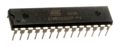
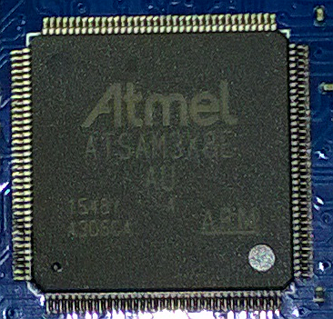
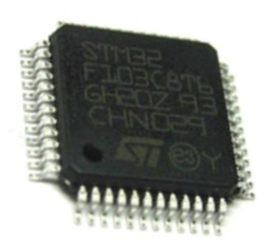
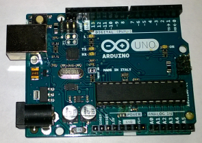
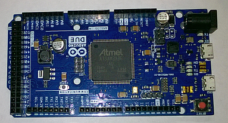
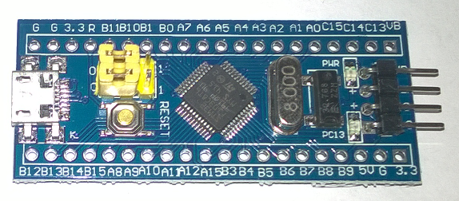
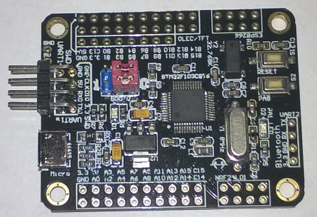

HwCpp Targets
===

<!--
TO DO list
- complete board descriptions
- add foto's
- add links to external info
- format the TOC better
- other name for blue brick
-->

<!-- update table_of_contents( input ) -->
    * [1 Introduction](#toc-anchor-0)

    * [2 Native](#toc-anchor-1)

    * [3 Chip targets](#toc-anchor-2)

       * [3.1 atMega328](#toc-anchor-3)

          * [3.1.1 Specifying this target](#toc-anchor-4)

          * [3.1.2 Target properties](#toc-anchor-5)

          * [3.1.3 Clock](#toc-anchor-6)

          * [3.1.4 IO items](#toc-anchor-7)

          * [3.1.5 example](#toc-anchor-8)

       * [3.2 atSam3x8e](#toc-anchor-9)

          * [3.2.1 Specifying this target](#toc-anchor-10)

          * [3.2.2 Target properties](#toc-anchor-11)

          * [3.2.3 Clock](#toc-anchor-12)

          * [3.2.4 IO items](#toc-anchor-13)

          * [3.2.5 example](#toc-anchor-14)

       * [3.3 STM32F103C8](#toc-anchor-15)

          * [3.3.1 Specifying this target](#toc-anchor-16)

          * [3.3.2 Target properties](#toc-anchor-17)

          * [3.3.3 Clock](#toc-anchor-18)

          * [3.3.4 IO items](#toc-anchor-19)

          * [3.3.5 example](#toc-anchor-20)

    * [4 Board targets](#toc-anchor-21)

       * [4.1 Arduino Uno](#toc-anchor-22)

          * [4.1.1 Specifying this target](#toc-anchor-23)

       * [4.2 Arduino Due](#toc-anchor-24)

          * [4.2.1 Specifying this target](#toc-anchor-25)

       * [4.3 Blue Pill](#toc-anchor-26)

          * [4.3.1 Specifying this target](#toc-anchor-27)

       * [4.4 Blue Brick](#toc-anchor-28)

          * [4.4.1 Specifying this target](#toc-anchor-29)

<!-- update end -->

<!-- -------------------------------------------------------------------- -->
<!-- -------------------------------------------------------------------- -->

<a name="toc-anchor-0"></a>
# 1 Introduction

This document describes the targets supported by HwCpp.
A target is either a (micro-controller) chip, 
or a board with such a chip and probably some other things.

The preferred way to use HwCpp is to include hwcpp.hpp in
the (single) source file, and specify the target on the
compiler command line as -DHWCPP_TARGET_<target_name>

When bmptk is used, the target is specified in the Makefile as
```
TARGET := <target_name>
```
and bmptk will put the appropriate define on the command line.

Alternatively, the application source file can include the 
targets/hwcpp-chip-<target-name>.hpp file directly.


<!-- -------------------------------------------------------------------- -->
<!-- -------------------------------------------------------------------- -->

<a name="toc-anchor-1"></a>
# 2 Native

HwCpp can build for the native target.
This might be useful for module tests, but is otherwise of little use.
Currently, HwCpp offers nothing specific to the native target.


<!-- -------------------------------------------------------------------- -->
<!-- -------------------------------------------------------------------- -->

<a name="toc-anchor-2"></a>
# 3 Chip targets

<!-- -------------------------------------------------------------------- -->
<!-- -------------------------------------------------------------------- -->

<a name="toc-anchor-3"></a>
## 3.1 atMega328



<a name="toc-anchor-4"></a>
### 3.1.1 Specifying this target

<table>
<tr><td>  bmptk makefile line           </td>
   <td>      TARGET := atmega328                  </td></tr>
<tr><td>  compiler command line define  </td>
   <td>      -DHWCPP_TARGET_atmega328             </td></tr>
<tr><td>  direct include                </td>
   <td>      #include "hwcpp-target-atmega328"    </td></tr>
</table>

<a name="toc-anchor-5"></a>
### 3.1.2 Target properties

<table>
<tr><td>   RAM     </td><td>   2k          </td></tr>
<tr><td>   FLASH   </td><td>  32k          </td></tr>
<tr><td>   EEPROM  </td><td>   1k          </td></tr>
<tr><td>   GPIO    </td><td>   23          </td></tr>
<tr><td>   CPU     </td><td>   8 bit AVR   </td></tr>
<tr><td>   CLOCK   </td>
   <td>   up to 8 MHz internal, up to 20 MHz Xtal    </td></tr>
</table>

This is an 8-bit AVR chip, popularized by the Arduino Uno.
The AVR architecture has separate code and data address spaces.
At C++ level this means that const data ends up in RAM because
pointers can only point into RAM, not into ROM.
You can still store constant data in ROM (using 
[PROGMEM](http://www.nongnu.org/avr-libc/user-manual/pgmspace.html) ), 
but you must copy it to RAM before use, 
or address it using special functions. 

<a name="toc-anchor-6"></a>
### 3.1.3 Clock

The clock can be either internal (1 MHz or 8 Mhz) or external
(Xtal up to 20 MHz). This is done in the configuration fuses,
which are NOT under program control.
Hence the clock frequency has no default (it must specified explicitly), 
and HwCpp assumes that you do this correctly.

<table>
<tr><td rowspan=3> supported clock parameter values </td>
       <td> 1'000'000  </td></tr>
   <tr><td> 16'000'000 </td></tr>
   <tr><td> 20'000'000 </td></tr>
</table>

At the moment, only busy waiting is available.

<table>
<tr>
   <th> Item name </th> 
   <th> HwCpp type </th>
</tr>  
<tr><td> timing   </td><td> waiting </td></tr>
<tr><td> waiting  </td><td> waiting </td></tr>
</table>

<a name="toc-anchor-7"></a>
### 3.1.4 IO items

<table>
<tr>
   <th> Service </th>
   <th> Item name </th> 
   <th> HwCpp type </th>
   <th> Shares GPIO </th>
</tr>  
<tr><td> GPIO  </td><td> b0 .. b7, c0 .. c6, d0 .. d7  </td>
   <td> pin_in_out </td><td></td></tr>
<tr><td> ADC   </td><td> a0 .. a5  </td>
   <td> adc<10>    </td><td> c0 .. c5 </td></tr>
<tr><td rowspan=4 > SPI  </td>
      <td> sck   </td><td> pin_out </td><td> b5  </td></tr>
  <tr><td> miso  </td><td> pin_in  </td><td> b4  </td></tr>  
  <tr><td> mosi  </td><td> pin_out </td><td> b3  </td></tr>  
  <tr><td> ss    </td><td> pin_out </td><td> b2  </td></tr>  
<tr><td rowspan=2> I2C   </td>
      <td> scl   </td><td> pin_oc  </td><td> c5  </td></tr>
  <tr><td> sda   </td><td> pin_oc  </td><td> c4  </td></tr>
<tr><td rowspan=2> UART  </td>
      <td> tx   </td><td> pin_out  </td><td> d0  </td></tr>
  <tr><td> rx   </td><td> pin_in   </td><td> d1  </td></tr>
</table>

<a name="toc-anchor-8"></a>
### 3.1.5 example

=> TBW


<!-- -------------------------------------------------------------------- -->
<!-- -------------------------------------------------------------------- -->

<a name="toc-anchor-9"></a>
## 3.2 atSam3x8e



<a name="toc-anchor-10"></a>
### 3.2.1 Specifying this target

<table>
<tr><td>  bmptk makefile line           </td>
   <td>      TARGET := atsam3x8e                  </td></tr>
<tr><td>  compiler command line define  </td>
   <td>      -DHWCPP_TARGET_atsam3x8e             </td></tr>
<tr><td>  direct include                </td>
   <td>      #include "hwcpp-target-atsam3x8e"    </td></tr>
</table>

<a name="toc-anchor-11"></a>
### 3.2.2 Target properties

<table>
<tr><td>   RAM     </td><td>   96k              </td></tr>
<tr><td>   FLASH   </td><td>  256k              </td></tr>
<tr><td>   GPIO    </td><td>   103               </td></tr>
<tr><td>   CPU     </td><td>  32 bit Cortex-M3   </td></tr>
<tr><td>   CLOCK   </td>
   <td>   8 MHz internal, up to 84 MHz with Xtal and PLL  </td></tr>
</table>

This is a 32-bit Cortex-M3 chip, popularized by the Arduino Due.

<a name="toc-anchor-12"></a>
### 3.2.3 Clock

The chip starts on the 8 Mhz internal clock.
With a 12 Mhz crystal and the PLL the clock bet set to 84 MHz
by the application.
The clock frequency has no default (it must specified explicitly).

<table>
<tr><td rowspan=2> supported clock parameter values </td>
       <td> 8'000'000                           </td></tr>
   <tr><td> 84'000'000 (assumes 12MHz crystal)  </td></tr>
</table>

At both busy waiting and clock-based waiting are available.

<table>
<tr>
   <th> Item name </th> 
   <th> HwCpp type </th>
</tr>  
<tr><td> timing    </td><td> clocking  </td></tr>
<tr><td> waiting   </td><td> waiting   </td></tr>
<tr><td> clocking  </td><td> clocking  </td></tr>
</table>

<a name="toc-anchor-13"></a>
### 3.2.4 IO items

=> TBW

<a name="toc-anchor-14"></a>
### 3.2.5 example

=> TBW


<!-- -------------------------------------------------------------------- -->
<!-- -------------------------------------------------------------------- -->

<a name="toc-anchor-15"></a>
## 3.3 STM32F103C8



<a name="toc-anchor-16"></a>
### 3.3.1 Specifying this target

<table>
<tr><td>  bmptk makefile line           </td>
   <td>      TARGET := stm32f103c8                </td></tr>
<tr><td>  compiler command line define  </td>
   <td>      -DHWCPP_TARGET_stm32f103c8           </td></tr>
<tr><td>  direct include                </td>
   <td>      #include "hwcpp-target-stm32f103c8"  </td></tr>
</table>

<a name="toc-anchor-17"></a>
### 3.3.2 Target properties

<table>
<tr><td>   RAM     </td><td>   20k               </td></tr>
<tr><td>   FLASH   </td><td>   64k               </td></tr>
<tr><td>   GPIO    </td><td>    37               </td></tr>
<tr><td>   CPU     </td><td>  32 bit Cortex-M3   </td></tr>
<tr><td>   CLOCK   </td>
   <td>   8 MHz internal, up to 72 MHz with Xtal and PLL  </td></tr>
</table>

This is a 32-bit Cortex-M3 chip, popularized by the Arduino Maple,
and used in al sorts of cheap Chinese boards, like the Blue Pill.

<a name="toc-anchor-18"></a>
### 3.3.3 Clock

The chip starts on the 8 Mhz internal clock.
With an 8 Mhz crystal and the PLL the clock bet set to 72 MHz
by the application.
The clock frequency has no default (it must specified explicitly).

<table>
<tr><td rowspan=2> supported clock parameter values </td>
       <td> 8'000'000                            </td></tr>
   <tr><td> 72'000'000 (assumes 12MHz crystal)   </td></tr>
</table>

At both busy waiting and clock-based waiting are available.

<table>
<tr>
   <th> Item name </th> 
   <th> HwCpp type </th>
</tr>  
<tr><td> timing    </td><td> clocking  </td></tr>
<tr><td> waiting   </td><td> waiting   </td></tr>
<tr><td> clocking  </td><td> clocking  </td></tr>
</table>

<a name="toc-anchor-19"></a>
### 3.3.4 IO items

=> TBW

<a name="toc-anchor-20"></a>
### 3.3.5 example

=> TBW


<!-- -------------------------------------------------------------------- -->
<!-- -------------------------------------------------------------------- -->

<a name="toc-anchor-21"></a>
# 4 Board targets

<!-- -------------------------------------------------------------------- -->
<!-- -------------------------------------------------------------------- -->

<a name="toc-anchor-22"></a>
## 4.1 Arduino Uno



<a name="toc-anchor-23"></a>
### 4.1.1 Specifying this target

<table>
<tr><td>  bmptk makefile line           </td>
   <td>      TARGET := arduino_uno                </td></tr>
<tr><td>  compiler command line define  </td>
   <td>      -DHWCPP_TARGET_arduino_uno           </td></tr>
<tr><td>  direct include                </td>
   <td>      #include "hwcpp-target-arduino-uno"  </td></tr>
</table>

This is a 32-bit Cortex-M3 chip, popularized by the Arduino Maple,
and used in al sorts of cheap Chinese boards, like the Blue Pill.

micro-controller
connectors
IO voltage
downloading
serial interface
on board

This is the modern version of the original, 
still tremendously popular Arduino board.
There are various clones of this board, which are equivalent but 
different in small details, for instance the USB-to-serial chips.

The connector pin names are the Arduino pin names, which
have no relation with the chip pin names.

The chip can be programmed directly through the 2x3 ICSP pin header,
or through the USB-to-serial converter, using the 
pre-programmed Arduino bootloader. 
This is a hands-off processes: 
the target chip is forced to reset and into bootload mode 
by the RTS and DTR lines of the serial interface.


<!-- -------------------------------------------------------------------- -->
<!-- -------------------------------------------------------------------- -->

<a name="toc-anchor-24"></a>
## 4.2 Arduino Due



<a name="toc-anchor-25"></a>
### 4.2.1 Specifying this target

<table>
<tr><td>  bmptk makefile line           </td>
   <td>      TARGET := arduino_due                </td></tr>
<tr><td>  compiler command line define  </td>
   <td>      -DHWCPP_TARGET_arduino_due           </td></tr>
<tr><td>  direct include                </td>
   <td>      #include "hwcpp-target-arduino-due"  </td></tr>
</table>

This Arduino board has the same form factor as the Arduino Mega, 
but uses the much more powerful atSam3xa Cortex-M3 micro-controller.
Note that unlike the Mega the IO voltage of the Due is 3.3V.

The connector pin names are the Arduino pin names, which
have no relation with the chip pin names.

The Due has two USB connectors. Both can be used to power the board.
The 'native' USB connector connects directly to the chip's USB interface. 
The 'programming' connector connects to an AVR chip that takes care
of programming the 


<!-- -------------------------------------------------------------------- -->
<!-- -------------------------------------------------------------------- -->

<a name="toc-anchor-26"></a>
## 4.3 Blue Pill



<a name="toc-anchor-27"></a>
### 4.3.1 Specifying this target

<table>
<tr><td>  bmptk makefile line           </td>
   <td>      TARGET := blue_pill                  </td></tr>
<tr><td>  compiler command line define  </td>
   <td>      -DHWCPP_TARGET_blue_pill             </td></tr>
<tr><td>  direct include                </td>
   <td>      #include "hwcpp-target-blue-pill"    </td></tr>
</table>

This is a popular and very cheap board with the 
STM32F103C8 micro-controller. 

The board has a micro-usb connector which is connected to the
chip's USB slave pins and can power the board,  but
this connector can't be used for hands-off bootloading.

There is a reset button and  pins that determine the bootmode are 
available on two jumpers, hence chip can be programmed by
in any way supported by the chip, but this would require fiddling with
the jumpers and pressing the reset button.

My preferred way to program this board is using a 
(clone) ST-LINK V2 programmer.
This requires a four-wire connection, which is (unfortunately)
not straight, check the pictures.


<!-- -------------------------------------------------------------------- -->
<!-- -------------------------------------------------------------------- -->

<a name="toc-anchor-28"></a>
## 4.4 Blue Brick



<a name="toc-anchor-29"></a>
### 4.4.1 Specifying this target

<table>
<tr><td>  bmptk makefile line           </td>
   <td>      TARGET := blue_brick                 </td></tr>
<tr><td>  compiler command line define  </td>
   <td>      -DHWCPP_TARGET_blue_brick            </td></tr>
<tr><td>  direct include                </td>
   <td>      #include "hwcpp-target-blue-brick"   </td></tr>
</table>

reset button, power LED
button, LED, 24C02 eeprom, coin battery
TF-card, 8-pin FLASH chip, 
ESP8266, NRF24L01, SW1053/W5500, OLED/TFT, bluetooth serial

This is a non-name board that is available on various sites. 
It uses the same STM32F103C8 chip as the Blue Pill, hence
I call it the Blue Brick. 
The main attraction of this board it that it some on-board 
peripherals (which can either be present or be unpopulated),
and connectors for a range of peripheral boards.

The board has a micro-usb connector which is connected to the
chip's USB slave pins and can power the board,  but
this connector can't be used for hands-off bootloading.

There is a reset button and  pins that determine the bootmode are 
available on two jumpers, hence chip can be programmed by
in any way supported by the chip, but this would require fiddling with
the jumpers and pressing the reset button.

My preferred way to program this board is using a 
(clone) ST-LINK V2 programmer.
This requires a four-wire connection, which is (unfortunately)
not straight, check the pictures.
